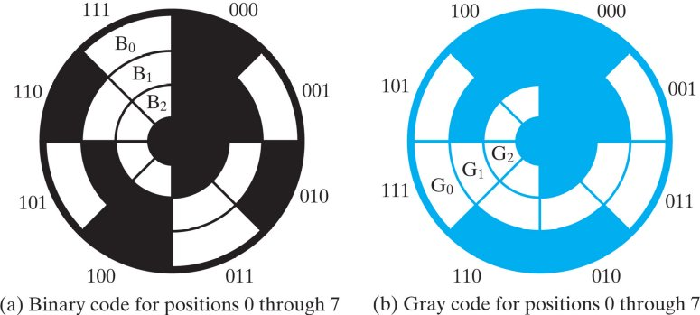

__Data Encoding__

[BCD - binary coded decimal](https://en.wikipedia.org/wiki/Binary-coded_decimal)
---
- computers save and process numbers in binary natively
- the way to represent data in binary is _data encoding_
- the 10 decimal digits can be encoded as BCD
  - each decimal digit takes 4 bits

|Decimal digit| | BCD |||
|:---:|:---:|:---:|:---:|:---:|
| |8|4|2|1|
|0|0|0|0|0|
|1|0|0|0|1|
|2|0|0|1|0|
|3|0|0|1|1|
|4|0|1|0|0|
|5|0|1|0|1|
|6|0|1|1|0|
|7|0|1|1|1|
|8|1|0|0|0|
|9|1|0|0|1|

📝 Practice
---
- $(663)_{10} = (0110 0110 0011)_{BCD}= (110 0110 0011)_2$
  - in the notation, it takes only 11 bits
  - but inside computer, it still takes 12 bits

Alphanumeric codes
---
- a charset for a language has all its alphabetic letters, number digits, punctuations, etc.
- the total number bits $N_b$ required to represent all symbols $N_s$ in a charset: $N_b = ⌈ \log_2 N_s ⌉$
  - number of bits for BCD: $N_b = ⌈ \log_2 N_s ⌉=⌈ \log_2 10 ⌉ ≈ ⌈ 3.322 ⌉ = 4$

[ASCII - American Standard Code for Information Interchange](https://en.wikipedia.org/wiki/ASCII)
---
- uses 7 bits to encode 128 characters
  - 94 printable characters
    - 26 upper case letters
    - 26 lower case letters
    - 10 decimal digits
    - 32 special characters
  - 32 nonprintable characters
- 
- ASCII is a 7-bit code, but usually saved in an 8-bit byte with the most significant bit as 0
  - 8-bit extension of ASCII can represent 128 more characters
  - called [extended ASCII](https://en.wikipedia.org/wiki/Extended_ASCII)

Localization
---
- adapts computers to different world regions and languages
- also called internationalization
- [Unicode](https://en.wikipedia.org/wiki/Unicode) represents most of the world's languages
  - each character is represented by a unique number called _code point_
    - noted as `U+` 4 to 6 hex digits
      - total range: `U+0000–U+10FFFF`
    - ASCII takes the first 128 code points `U+0000` to `U+007F`
  - three standard unicode encoding schemes: 
    - `UTF-8`: variable-length encoding, 1 to 4 bytes
    - `UTF-16`: variable-length encoding, each 2 or 4 bytes
    - `UTF-32`: fixed-length encoding, each 4 bytes

[UTF-8](https://en.wikipedia.org/wiki/UTF-8)
---
- dominates webpage encoding
- capable of encoding all 1,112,064 valid Unicode code points
- Code point ↔ UTF-8 conversion table

|||||||
|:---:|:---:|:---:|:---:|:---:|:---:|
| First code point | Last code point | Byte 1 | Byte 2 | Byte 3 | Byte 4 |
| U+0000 | U+007F | 0xxxxxxx |     |     |     |
| U+0080 | U+07FF | 110xxxxx | 10xxxxxx |     |     |
| U+0800 | U+FFFF | 1110xxxx | 10xxxxxx | 10xxxxxx |     |
| U+10000 | U+10FFFF | 11110xxx | 10xxxxxx | 10xxxxxx | 10xxxxxx |

[Error detection and correction encoding](https://en.wikipedia.org/wiki/Error_detection_and_correction)
---
- used to detect even correct errors
- [popular error detection code](https://en.wikipedia.org/wiki/List_of_algorithms)
  - parity bit
  - gray code
  - Cyclic redundancy check
  - Hamming code

[parity bit](https://en.wikipedia.org/wiki/Parity_bit)
---
- also called check bit
- a bit added to a string of binary digits
- ensures that the total number $N$ of 1-bits (including the parity bit) in the string is 
  - even: makes $N$ even
  - or odd: makes $N$ odd

| 7 bits of data | (count of 1-bits) | 8 bits including parity |     |
| --- | --- | --- | --- |
||| even | odd |
| 0000000 | 0   | 0000000**0** | 0000000**1** |
| 1010001 | 3   | 1010001**1** | 1010001**0** |
| 1101001 | 4   | 1101001**0** | 1101001**1** |
| 1111111 | 7   | 1111111**1** | 1111111**0** |

- parity bit can detect odd numbers of errors or _bit-flips_
  - but can't detect even numbers of errors
  - usually asks for retransmission when detected errors

[Gray code](https://en.wikipedia.org/wiki/Gray_code)
---
- also called _reflected binary code (RBC)_ or _reflected binary (RB)_
- an ordering of the binary numeral system such that _two successive values differ in only one bit_ 
  - saves power since bit flip consumes electricity
  - reliable encoding

| Decimal | Binary | Gray | Decimal   of Gray |
| --- | --- | --- | --- |
| 0   | 0000 | 0000 | 0   |
| 1   | 0001 | 0001 | 1   |
| 2   | 0010 | 0011 | 3   |
| 3   | 0011 | 0010 | 2   |
| 4   | 0100 | 0110 | 6   |
| 5   | 0101 | 0111 | 7   |
| 6   | 0110 | 0101 | 5   |
| 7   | 0111 | 0100 | 4   |
| 8   | 1000 | 1100 | 12  |
| 9   | 1001 | 1101 | 13  |
| 10  | 1010 | 1111 | 15  |
| 11  | 1011 | 1110 | 14  |
| 12  | 1100 | 1010 | 10  |
| 13  | 1101 | 1011 | 11  |
| 14  | 1110 | 1001 | 9   |
| 15  | 1111 | 1000 | 8   |

- many applications, such as encoding shaft angle positions
- 

|     |     |     |     |     |
| --- | --- | --- | --- | --- |
| Sector | Contact 1 | Contact 2 | Contact 3 | Angle |
| 0   | off | off | off | 0° to 45° |
| 1   | off | off | ON  | 45° to 90° |
| 2   | off | ON  | off | 90° to 135° |
| 3   | off | ON  | ON  | 135° to 180° |
| 4   | ON  | off | off | 180° to 225° |
| 5   | ON  | off | ON  | 225° to 270° |
| 6   | ON  | ON  | off | 270° to 315° |
| 7   | ON  | ON  | ON  | 315° to 360° |
