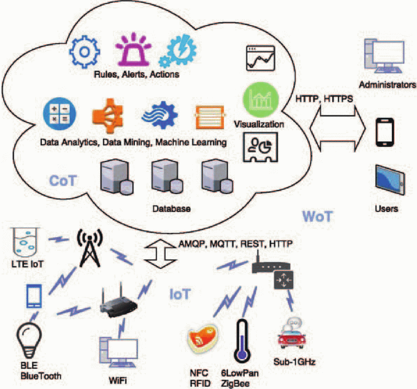
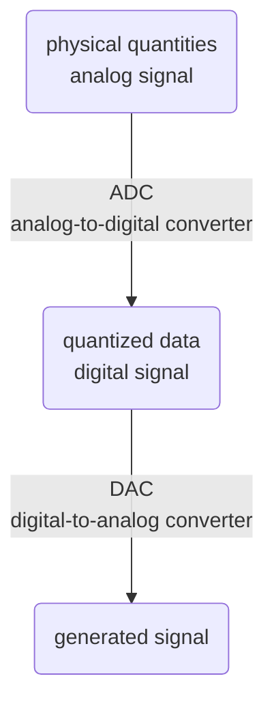

__Digital Systems__
_lcdf5 chapter 1_

Digital systems and information
---
- 
- information is represented as data
- data is encoded as number
- digital computer p2
- embedded systems p5

Signal flow diagram
---

Signal flow illustration
---
p3
- 

Quantization
---
p4
| 2-bit resolution | 3-bit resolution |
| --- | --- |
|  | 

[Logic signal voltage levels](https://www.allaboutcircuits.com/textbook/digital/chpt-3/logic-signal-voltage-levels/)
---
- 

p1

| level\truth | Positive logic | Negative logic |
| --- | --- | --- |
| high | true (1) | false (0) |
| low | false (0) | true (1) |

[Units of information](https://en.wikipedia.org/wiki/Units_of_information)
---
p7
| Unit | # of bits |  # of values representable | number ranges |
| --- | --- | --- | --- |
| bit | 1 | $2^1=2$ | 0, 1 |
| nibble | 4 | $2^4=16$ | 0, 1, 2, ..., 15 |
| byte | 8 | $2^8=256$ | 0, 1, 2, ..., 255 |
| word | 16 | $2^{16} = 65536$ | 0, 1, 2, ..., 65535 |
| dword | 32 | $2^{32} = 4294967296$ | 0, 1, 2, ...,  4294967295 |
| qword | 64 | $2^{64} = 18446744073709551616$ | 0, 1, 2, ..., 18446744073709551615 |

A vertical profile of a computer
---
p6
| layer | name |
| --- | --- |
| S | Applications |
| S | Programming languages and libraries |
| S | Operating systems |
| SH | Instruction set architecture (ISA) | 
| SH | Micro-architecture |
| `H` | `Register transfers` |
| `H` | `Logic gates` |
| P | Transistor circuits |

- S: software; SH: abstract layer between software and hardware
- H: hardware; P: physical entities 

# References
- [Analog-to-digital converter](https://en.wikipedia.org/wiki/Analog-to-digital_converter)
- [Quantization (signal processing)](https://en.wikipedia.org/wiki/Quantization_(signal_processing))
