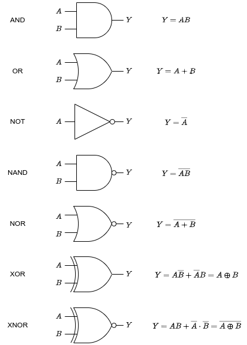

# Combinational logic circuits
_lcdf5 chapter 2_

Objectives
---
- describe combinational logic circuits in
  - boolean equations
  - schematics
  - HDL (hardware description language)
- optimize combinational logic circuits with
  - Karnaugh maps


Boolean algebra
---
- the math behind combinational logic
- the domain $D$ has only two values or constants: `TRUE (T, 1); FALSE (F, 0)`
- each variable $x$ takes value of `1` or `0` at a time
- three basic operators:
  - `AND`, ∩, ∧, ⋅
    - x AND y, x∩y, x∧y, x⋅y, `xy`
    - true only when both x and y are true
  - `OR`, ∪, ∨, +
    - x∪y, x∨y, `x+y`
    - false only when both x and y are false
  - `NOT`, ¬, ‾
    - ¬x, $\overline{x}$
    - negate or flip x


Truth table of basic operations
---
| A | B | A+B | AB| $\overline{A }$ |
|:---:|:---:|:---:|:---:|:---:|
| 0 | 0 | `0` | 0 | 1 |
| 0 | 1 | 1 | 0 | 1 |
| 1 | 0 | 1 | 0 | 0 |
| 1 | 1 | 1 | `1` | 0 |

Laws of Boolean algebra 
---
| law | equation |
|:---:|:---:|
| basic | $0+A=A$ <br>$1A=A$<br> $0A=0$ <br> $1+A=1$ <br> $\overline{A}+A=1$ <br> $\overline{A}A=0$ <br> $\overline{\overline{A}}=A$|
| commutation | $AB=BA$ <br> $A+B=B+A$ |
| association | $(A+B)+C=A+(B+C)$ <br> $(AB)C=A(BC)$ |
| distribution | $A(B+C)=AB+AC$ <br>⚠️ $A+(BC)=(A+B)(A+C)$ |
| idempotence <br>identity| $A+A=A$<br> $AA=A$  |
| absorption <br> redundance | $A+AB=A$ <br> $A(A+B)=A$ <br> $A+\overline{A}B=A+B$ <br> $A(\overline{A}+B)=AB$ |
| expansion | $A=AB+A\overline{B}$ <br> $A=(A+B)(A+\overline{B})$ |
| **De Morgan** | $\overline{A_1+A_2+⋯+A_n}=\overline{A_1}⋅\overline{A_2}⋯\overline{A_n}$ <br> $\overline{A_1A_2⋯A_n}=\overline{A_1}+\overline{A_2}+⋯+\overline{A_n}$ |


How to draw a truth table
---
- $Y=f(X_1, X_2, ⋯, X_n)$
- $2^n$ + 1 rows
  - a header row with $n+1$ columns: $X_1, X_2, ⋯, X_n, Y$
  - $2^n$ rows for all possible instantiations of $X_1, X_2, ⋯, X_n$
    - $00⋯00, 00⋯01, 00⋯10, 00⋯11, ⋯ 11⋯11$


💡 [Prove Boolean equations with truth table](https://www.emathhelp.net/en/calculators/discrete-mathematics/truth-table-calculator/)
---
- basic law
- De Morgan's law


💡 [Prove Boolean equations with other equations](https://www.emathhelp.net/en/calculators/discrete-mathematics/boolean-algebra-calculator/)
---
- identity law
- absorption law
- expansion law


The *dual* of an algebraic expression
---
- can be obtained by
  - interchanging OR and AND operators
  - flipping 1s and 0s
- the *duality principle* of Boolean algebra
  - a Boolean equation is valid ↔ its dual equation is valid
  - the duel equation of an equation is obtained by
    - taking duals of both sides of the equation, ex.


📝 Demo
---
- Find the pairs of dual equations in the table of Boolean equations
- Simplify $F=\overline{X}YZ+\overline{X}Y\overline{Z}+XZ$
  - ans: $F=\overline{X}Y+XZ$
  - verify your simplification with truth table


📝 Practice
---
- Prove the *consensus theorem*
  - $XY+\overline{X}Z+YZ=XY+\overline{X}Z$
- by
  - Algebraic manipulation
  - Truth table
- Find the duel equation of the consensus theorem
  - ans: $(X+Y)(\overline{X}+Z)(Y+Z)=(X+Y)(\overline{X}+Z)$
  - prove it holds
- Prove $(A+B)(\overline{A}+C) = AC+\overline{A}B$


The complement of a function $F$
---
- $\overline{F}$ can be obtained in three ways by
  - ➊ flipping `0s` and `1s` for the values of $F$ in its truth table
  - ➋ or applying DeMorgan's law
  - ➌ or interchange AND and OR operators, complement each constant and variable
    - i.e. taking dual form
    - complementing each variable


💡 Demo
---
- Find the complement of $F=\overline{X}Y\overline{Z}+\overline{X}⋅\overline{Y}Z$ using methods ➋ and ➌


📝 Practice
---
- Find the complement of $F=X(YZ+\overline{Y}⋅\overline{Z})$ using methods ➋ and ➌


XOR and XNOR
---
- XOR: exclusive or
  - $Y=A\overline{B}+\overline{A}B=A⊕B$
  - $Y$ is true only when $A$ is different from $B$
- XNOR: exclusive nor
  - $Y=AB+\overline{A}⋅\overline{B}=\overline{A⊕B}$
  - NXOR
  - $Y$ is true only when $A$ is same as $B$


XOR equations
---
| law | equation |
|:---:|:---:|
| basic | $0⊕A=A$ <br>$1⊕A=\overline{A}$<br> $\overline{A}⊕A=1$ <br> $A⊕A=0$ |
| commutation | $A⊕B=B⊕A$ |
| association | $(A⊕B)⊕C=A⊕(B⊕C)$ |


Logic gates
---
- A computer consists of many ICs (integrated chips)
- An IC consists of many logic gates
- Basic logic gates (ch2.p4)




Gate extension and combination
---
- gate AND, OR, NAND, NOR can be extended to have more than two inputs
- each basic gate can be implemented with several other basic gates (ch2.p5)
  - ❶An AND gate can be implemented with a NAND gated output to a NOT gate
    - $Y=\overline{\overline{AB}}$
  - ❷An OR gate can be implemented with two NOT gates output to a NAND gate
    - $Y=\overline{\overline{A}⋅\overline{B}}$
  - ❸All basic gates can be implemented with several NAND gates
- many gates are combined to implement complex logic functions


💡 Demo
---
- Draw the circuits for ❶❷❸ with [draw io](https://app.diagrams.net/)


Describe gates in HDL
---
- structural description
  - describes 
  - referred to as netlist
- dataflow description
  - describes circuit functions using concurrent assignments
  - ⚠️ *concurrent assignments executes in parallel*
- behavioral description
  - describes circuit behavior (algorithms) in both concurrent assignments and sequential statements
- Verilog hdl has primitives for logic gates
  - while VHDL use logic operators

| gate | Verilog <br>primitives | VHDL logic<br> operators |
|:---:|:---:|:---:|
| AND | and | and |
| OR | or | or |
| NOT | not | not |
| NAND | nand | nand |
| NOR | nor | nor |
| XOR | xor | xor |
| XNOR | xnor | xnor |

- example instances for Verilog primitives
  - `and(Y, A, B);`
  - `not(Y, A);`
- example statements for VHDL logic operators
  - `Y <= A and B;`
  - `Y <= not A;`


💡 Demo
---
- Design a control circuit for majority voting of three parties
  - at least two parties vote for pass then pass
- Describe this control system in 
  - boolean function
    - $P = AB\overline{C}+A\overline{B}C+\overline{A}BC+ABC$
  - truth table
    - number of rows: $2^{N_i}$
    - $N_i$ is the number of inputs
  - circuit diagram
  - HDL description
    - Verilog HDL
    - VHDL

```verilog
// verilog HDL description
// case sensitive
module majority_voter(P, A, B, C);
  output P;
  input A,B,C;
  wire nA, nB, nC;
  wire ab, ac, bc, abc;
  wire p1,p2,p3,p4,p12,p34;

  not(nA, A);
  not(nB, B);
  not(nC, C);

  and(ab, A, B);
  and(p1, ab, nC);
  and(bc, B, C);
  and(p2, bc, nA);
  and(ac, A, C);
  and(p3, ac, nB);
  and(p4, ac, C);

  or(p12, p1, p2);
  or(p34, p3, p4);
  or(P, p12, p34);
endmodule
```

```vhdl
-- VHDL description
-- case insensitive
library IEEE, LCDF_VHDL;
use IEEE.STD_LOGIC_1164.all, LCDF_VHDL.FUNC_PRIMS.all;

entity majority_voter is
  port
  (
    P       : out std_logic;
    A, B, C : in std_logic);
end majority_voter;

architecture structural of majority_voter is
  component NOT1
    port
    (
      X  : in std_logic;
      Y  : out std_logic);
  end component;  
  component AND3
    port
    (
      X1, X2, X3 : in std_logic;
      Y          : out std_logic);
  end component; 
  component OR4
    port
    (
      X1, X2, X3, X4 : in std_logic;
      Y          : out std_logic);
  end component;

  signal nA, nB, nC, ab, ac, bc, abc : std_logic;

  begin
    n1 : NOT1 port map (A, nA);
    n2 : NOT1 port map (B, nB);
    n3 : NOT1 port map (C, nC);
    a1 : AND3 port map (A, B, nC, ab);
    a2 : AND3 port map (A, nB, C, ac);
    a3 : AND3 port map (nA, B, C, bc);
    a4 : AND3 port map (A, B, C, abc);
    o1 : OR4 port map (ab, ac, bc, abc, Y);
end structural;
```

📝 Practice
---
- Describe Boolean function $L = D\overline{X} + A$ in 
  - truth table (ch2.p9)
  - circuit diagram (ch2.p10)
  - HDL description
    - Verilog HDL (ch2.p11)
    - VHDL (ch2.p12)


Number of descriptions of a logic circuit of each method
---
- There is only one way for truth table, however
- There are many ways for the other three methods
  - the simplest form is desired


Boolean function standard forms
---
- facilitate the simplification procedures
- facilitate implementing logic circuits
- contain two types of terms
  - *product terms* such as $A, AC, AB\overline{C}$, etc.
    - there are $3^n-1$ product terms for $n$ variables
  - *sum terms* such as $A, A+C, A+B+\overline{C}$, etc.
    - there are $3^n-1$ sum terms for $n$ variables
- two types of standard forms
  - *sum of products (sop)* such as $F=AB + \overline{B} + \overline{A}B\overline{C}$
  - *product of sums (PoS)* such as $F=A(\overline{B}+C)(A+B+\overline{C})$

💡 Demo
---
- list all the product and sum terms for 2,3,4 variables


minterms and maxterms of a function $F$
---
- a *minterm* is a product term contains all the variables of $F$
  - each variable shows up exactly once, either complemented or uncomplemented
  - there are $2^n$ minterm for $n$ variables $A_1,A_2,⋯, A_n$
    - denoted as $m_0$ to $m_{2^n-1}$
    - $m_0=\overline{A_1}⋅\overline{A_2}⋯\overline{A_n}$
    - $m_i$ is the term has the binary number equals to decimal $i$ by substituting $A_k=1$ and $\overline{A_k}=0$
    - $m_{2^n-1}=A_1A_2⋯A_n$
- *maxterms* are the complements of minterms
  - denoted as $M_0$ to $M_{2^n-1}$
  - $M_i = \overline{m_i}$


💡 Demo
---
- Find all the minterms and maxterms for
  - one variable $A$
    - $m_0=\overline{A}, M_0=\overline{m_0}=A$
  - two variables $A,B$
    - $m_0=\overline{A}⋅\overline{B}, M_0=\overline{m_0}=A+B$
    - $m_1=\overline{A}B, M_1=\overline{m_1}=A+\overline{B}$
    - $m_2=A\overline{B}, M_2=\overline{m_2}=\overline{A}+B$
    - $m_3=AB, M_2=\overline{m_2}=\overline{A}+\overline{B}$
- Derive the truth table for each term
  - $m_i=1$ only if $B(m_i)=i$
    - $B(m_i)$ is the binary number by replacing X with 1 and $\overline{X}$ with 0
  - $M_i=0$ only if $B(M_i)=i$
    - $B(M_i)$ is the binary number by replacing X with 0 and $\overline{X}$ with 1


📝 Practice 
---
- Find all the minterms and maxterms for 
  - three variables
  - four variables
- Derive the truth table for each term
  - three variables (ch2.p17, p18)
  - four variables

💡 Sum of minterms
---
- An example
  - $F=X\overline{Y}+XY=m_2+m_3=Σm(2,3)$
- the minterms of $\overline{F}$ are those minterms NOT in $F$, i.e.
  - $\overline{F}=Σm(0,1)=\overline{X}⋅\overline{Y}+\overline{X}Y$
- take the complement of $\overline{F}$ to get $F$
  - $F=\overline{\overline{F}}=\overline{Σm(0,1)}=\overline{m_0+m_1}=\overline{m_0}⋅\overline{m_1}=M_0M_1=(X+Y)(X+\overline{Y})=ΠM(0,1)$
  - we get the *product of maxterms* of $F$
- draw the *two-level circuits* for $F$ in the two forms


📝 Practice
---
- Apply the demo steps on
  - $F = \overline{X}⋅\overline{Y}⋅\overline{Z} + \overline{X}⋅Y⋅\overline{Z}+X\overline{Y}Z+XYZ$
- to find the PoM $F$
  - $F=ΠM(1,3,4,6)$
- draw the *two-level circuits* for $F$ in the two forms


💡 Demo
---
- Convert $F=\overline{Y}+\overline{X}Z$ into som and PoM using two ways: 
  - ➊ truth table and 
  - ➋ algebraic manipulation
  - ans: $F=∑m(0,1,2,4,5)=ΠM(3,6,7)$


📝 Practice
---
- Convert 
  - $F_1=XY+ \overline{Y}+\overline{X}Y\overline{Z}$ 
  - $F_2=\overline{Y}+\overline{X}⋅\overline{Y}$
  - $F_3=(XY+Z)(Y+XZ)$
  - $F_4=AB+C(D+E)$
  - $F_5=X(\overline{Y}+Z)(X+Y+\overline{Z})$

into som and PoM using two ways: 

  - ➊ truth table and 
  - ➋ algebraic manipulation
  - ans: $F_1=∑m(0,1,2,4,5)=ΠM(3,6,7)$


Properties of the standard forms
---
- Any Boolean function can be expressed as 
  - a logical sum of minterms (som)
  - or a logical product of maxterms  (PoM)
- A som function that includes all the $2^n$ `minterms` is equal to logic `1`
- A PoM function that includes all the $2^n$ `maxterms` is equal to logic `0`


Optimize two-level circuits
---
- sop and PoS circuits can be implemented in two-level circuits
  - can be optimized by minimizing the gates used
- two popular ways for simplifying a Boolean function
  - algebraic manipulation
    - difficult to determine whether the simplest expression has been achieved
  - Karnaugh map (K-map)
    - a visual method
    - suitable for Boolean functions of up to four variables


K-map of $Y=F(X_1,X_2, ⋯, X_n)$
---
- a rectangle made up of $2^n$ squares, $n≤4$
   - the squares are labeled with Gray code of $(X_1,X_2, ⋯, X_n)$
- each square representing one row (i.e. one minterm) of the truth table 
   - one minterm of a single output function
- *adjacent terms* differ exactly one literal which appears uncomplemented in one and complemented in the other,e.g.
  - $AB, A\overline{B}$ so $AB + A\overline{B} = A(B+\overline{B})=A$
  - $\overline{A}BC, \overline{A}\overline{B}C$ so $\overline{A}BC+ \overline{A}\overline{B}C=\overline{A}C$
- ch2.p23

💡 Demo
---
- [Draw K-maps of 2,3,4 variables](https://www.boolean-algebra.com/kmap)


Map manipulation
---
- All rectangles on a map made up of $2^m, m=0,1,2,⋯,n$ squares containing 1s correspond to *implicants*
- *Prime implicant* is an implicant that is as large as possible
- *Essential prime implicant* is a prime implicant that contains at least one term not covered by another prime implicant
- *Selection rule*: minimize the overlap among prime implicants as much as
possible


💡 Demo
---
- Simplify the following som's with K-map
  - $F_0(A,B)=Σm(0,1,3)$ ch2.p24, p25.a
    - $F_0=\overline{A}+B$
  - $F_1(A,B)=Σm(1,2)$ p25.b
    - $F_1=\overline{A}B+A\overline{B}$
  - $F_2(A,B,C)=Σm(0,1,2,3,4,5)$ p26.a
    - $F_2=\overline{A}+\overline{B}$
  - $F_3(A,B,C)=Σm(0,2,4,5,6)$ p26.b
    - $F_3=A\overline{B}+\overline{C}$
  - $F_4(A,B,C)=Σm(1,3,4,5,6)$ p26.c
    - $F_4=\overline{A}C+A\overline{B}+A\overline{C}$
  - $F_5(A,B,C,D)=Σm(0,1,2,4,5,6,8,9,10,12,13)$ p27
    - $F_5=\overline{C}+\overline{AD}+\overline{BD}$
  - $F_6(A,B,C,D)=\overline{ACD}+\overline{A}D+\overline{B}C+CD+A\overline{BD}$ p28.a
    - $F_6=Σm(0,1,2,3,4,5,7,8,10,11,15)=\overline{BD}+\overline{AC}+CD$ p28.b
  - $F_7(A,B,C,D)=Σm(1,3,4,5,6,7,12,14)$ p29
    - $F_7=\overline{A}D+B\overline{D}$
  - $F_8(A,B,C,D)=Σm(0,5,10,11,12,13,15)$ p30.a
    - $F_8=\overline{ABCD}+B\overline{C}D+AB\overline{C}+A\overline{B}C+ACD$, p30.b or
    - $=\overline{ABCD}+B\overline{C}D+AB\overline{C}+A\overline{B}C+ABD$ p30.b
  - $F_9(A,B,C,D)=Σm(0,1,2,4,5,10,11,13,15)$ p31
    - $F_9=\overline{AC}+ABD+A\overline{B}C+\overline{ABD}$


💡 Demo
---
- Simplify PoM forms
  - $F(A,B,C,D)=Σm(0,1,2,5,8,9,10)$ p32
    - ❶ Find $\overline{F}=Σm(3,4,6,7,11,12,13,14,15)$
      - i.e. the squares filled with 0's
    - ❷ Simplify $\overline{F}$ to sop: $\overline{F}=AB+CD+B\overline{D}$
    - ❸ $F=\overline{\overline{F}}=(\overline{A}+\overline{B})(\overline{C}+\overline{D})(\overline{B}+D)$


Incompletely specified functions
---
- whose outputs are not completely specified
  - ❶ not used for some input combinations, i.e. minterms
    - such as in BCD, 6 combinations are not used
  - ❷ we don't care the outputs for some input combinations
  - both conditions are called *don't care conditions*
    - these minterms are marked with an `x` on K-map
      - i.e. can be used as 1 in som or 0 in PoM as will


💡 Demo
---
- Use don't care conditions to simplify
  - $F(A,B,C,D)=Σm(1,3,7,11,15)$
  - Don't care conditions: $d(A,B,C,D)=Σm(0,2,5)$
  - ans:
    - sop: $F=CD+\overline{A}⋅\overline{B}$ (p33.a) or $F=CD+\overline{A}D$ (p33.b)
    - PoS: $F=D(C+\overline{A})$ 
      - from $\overline{F}=\overline{D}+A\overline{C}$


💡 Demo (optional)
---
- An odd function outputs 1 if and only if odd number of input variables are equal to 1
  - $X⨁Y⨁Z=X\overline{Y}⋅\overline{Z}+\overline{X}Y\overline{Z}+\overline{X}⋅\overline{Y}Z+XYZ$ p34.a, p35.a
  - $A⨁B⨁C⨁D$ p34.b, p35.b
- An Even function outputs 1 if and only if even number of input variables are equal to 1


# References
- [symbolab](https://www.symbolab.com/solver/boolean-algebra-calculator)
- [emathhelp](https://www.emathhelp.net/en/calculators/discrete-mathematics/boolean-algebra-calculator/)
- [dcode](https://www.dcode.fr/minterms-maxterms-calculator)
