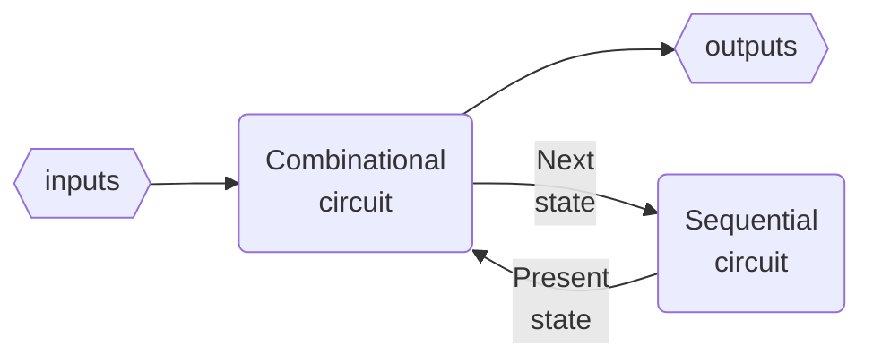
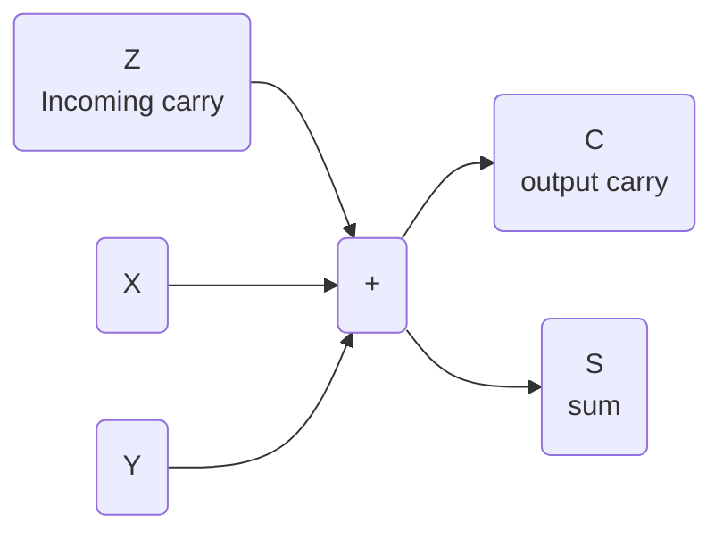

# Combinational logic design
_lcdf5 chapter 3_

Topics
---
- Top-down design
- Technology mapping
- Combinational functional blocks
- Rudimentary logic functions
- Decoding, encoding and selecting
- Interactive combinational circuits
- Arithmetic circuits
  - Binary adders
  - Binary subtraction
  - Binary adder-subtractors
  - Other arithmetic functions

Digital system design procedure
---

- ❶ specify functions and requirements
- ❷ formulate specification in Boolean equation or truth table
- ❸ optimize formulation
- ❹ map optimization to implementation technology
  - typically one of the two universal gates: NAND or NOR
- ❺ verify that the implementation fullfil the specification

Top-down design
---
- also called hierarchical design
- a divide-and-conquer method
- break the digital system into implementable or reusable building blocks
- combine the building blocks into the final digital system

🍎 Design of a 4-bit equality Comparator
---
- specification: p1.a
  - output 1 if A[3:0]==B[3:0] else 0
- formulation: p1.b,p1.c
  - compare bit-by-bit respectively
  - aggregate the 4 outputs
  - $E = (A[3]⨁B[3])(A[2]⨁B[2])(A[1]⨁B[1])(A[0]⨁B[0])$
- optimization:
  - algebraic manipulation
  - truth table
  - $N_i=\overline{A_i}B_i+A_i\overline{B_i}$
  - $E=\overline{N_0+N_1+N_2+N_3}$
- mapping to nand gates+inverters, or nor gates+inverters p3

| gate | nand  | nor |
|:---:|:---:|:---:|
| AND | NAND->NOT | NOTS->NOR |
| OR | NOTS->NAND | NOR->NOT |
| NOT | NAND | NOR |

- NOT gate is usually called inverter
  - can be implemented by a NAND or NOR by tying their inputs together as a single input
- NOT->NOT cancels

Building blocks p2
---
- primitive blocks
- predefined blocks
- regular circuits are scalable
  - irregular circuits are non-scalable
- a copy of a reusable building block is an instance of it
  - the procedure is called instantiation

🍎 Example
---
Implementation the following functions with NAND gates+inverters, then NOR gates+inverters
- $F = AB + \overline{(AB)}C + \overline{(AB})\overline{D} + E$
  - NAND gates+inverters p4
  - NOR gates+inverters p5

Rudimentary Logic Functions
---
p6

Functions of one variable
---
p7
| $X$ | $F=0$ Fixing | $F= 1$ Fixing| $F=X$ Transferring | $F=\overline{X}$ Inverting |
|:--:|:--:|:--:|:--:|:--:|
| 0 | 0 | 1 | 0 | 1 |
| 1 | 0 | 1 | 1 | 0 |

- implementation of functions of a single variable X p8

Multiple-bit functions
---
p9
- vectors of single-bit functions
- $F[n:0] = (F_{n-1}, ⋯, F_2, F_1, F_0)$
  - $F[n-1:0]$ is a n-bit bus
- $F_i=G_i(A_{m-1},  ⋯, A_1,A_0)=G_i(A[m-1:0])$
  - $A[m-1:0]$ is a m-bit bus

💡  Design Lecture-Hall Lighting Control
---
- The house light (H) is controlled by two switches
  - $P$ - podium switch
  - $R$ - rear door switch
- in three modes
  - $M_0$: Either switch P or switch R turns the house lights on and off
  - $M_1$: Only the podium switch P turns the house lights on and off
  - $M_2$: Only the rear switch R turns the house lights on and off
- This requirement is specified in truth table p10
- formulation:
  - $H(P,R,I_0,I_1,I_2,I_3)=\overline{P}⋅\overline{R}I_0+\overline{P}RI_1+P\overline{R}I_2+PRI_3$
    - the modes are selected by $I[3:0]$
  - implementation: p11
  - $I[3:0]$ work as enabling signals p12

💡 Design Car electrical Control using enabling
---
- Inputs
  - Ignition switch IG: Value 0 if off and value 1 if on
  - Light switch LS: Value 0 if off and value 1 if on
  - Radio switch RS: Value 0 if off and value 1 if on
  - Power window switch WS: Value 0 if off and value 1 if on
- Outputs
  - Lights L: Value 0 if off and value 1 if on
  - Radio R: Value 0 if off and value 1 if on
  - Power windows W: Value 0 if off and value 1 if on
- specification: 
  - in truth table p13
- implementation: p14

Decoding
---
- An n-bit binary code is capable of representing up to $2^n$ distinct elements of coded information
- Decoding is the conversion of an n-bit input code $m_i$ to an m-bit output code with $n ≤ m ≤ 2^n$, done by a n–to–m-line decoder
  - generates no more than $2^n$ minterms from the n input variables
  - so only one output value $D_i$ is set to be 1 for each input value $m_i$
- 1-to-2 decoder: p15
   - $D[1:0]=[A,\overline{A}]$
   - $D_i=m_i$
- 2-to-4 decoder: p16
  - $D[3:0]=[A_1A_0, A_1\overline{A_0}, \overline{A_1}A_0, \overline{A_1A_0}]$
  - $D_i=m_i$
  - can be constructed in 2 1-to-2 decoder+ 4 AND gates
- 3-to-8 decoder: p17
  - can be constructed in 1 2-to-4 decoder + 1 1-to-2 decoder + 8 AND gates
- generally, for a n-to-$2^n$ decoder:
  - ❶ let k=n
  - ❷ if k is even, use $2^k$ AND gates driven by two $\frac{k}{2}$-to-$2^{\frac{k}{2}}$ decoders
  - if n is odd, use $2^k$ AND gates driven by a $\frac{k + 1}{2}$-to-$2^{\frac{k + 1}{2}}$ decoder and a $\frac{k - 1}{2}$-to-$2^{\frac{k - 1}{2}}$ decoder 
  - k = k/2
  - ❸ For each decoder resulting from step ❷, repeat step ❷ with k equal to the values obtained in step ❷ until k = 1. For k = 1, use a 1–to–2 decoder

💡 Demo
---
- Design a 6-to-64 decoder p18
- first run of step ❷:
  - k=6: $2^6=64$ AND gates driven by two 3-to-8 decoders. k=k/2=3
- second run of step ❷:
  - k=3: $2^3=8$ AND gates driven by a 2-to-4 decoder and  a 1-to-2 decoder

📝 Practice
---
- Design the following decoders
  - 4-to-16 decoder
  - 5-to-32 decoder

Enabling Decoder Outputs
---
- attach m enabling circuits to the decoder outputs p19
  - such a circuit is called a *demultiplexer*

Decoder-Based Combinational Circuits
---
- Any combinational circuit with n inputs and m outputs can be implemented with an n–to–$2^n$-line decoder and m OR gates
  - A decoder provides the $2n^$ minterms of n input variables
  - any Boolean function can be expressed as a sum of minterms
- A function having a list of $k$ minterms can be expressed in its complement form with $2^n - k$ minterms

💡 Implement a 1-bit binary adder
---

- specification in truth table p24
- formulation:
  - $S(X, Y, Z ) = Σm (1, 2, 4, 7)$
  - $C(X, Y, Z ) = Σm(3, 5, 6, 7)$
- implementation p25
  

📝 Practice
---
- Reimplement the 1-bit binary adder with complements
- formulation:
  - $\overline{S}(X, Y, Z ) = Σm (0,3,5,6)$
  - ∴ S(X, Y, Z ) = $\overline{Σm (0,3,5,6)}$
  - $\overline{C}(X, Y, Z ) = Σm(0,1,2,4)$
  - ∴ $C(X, Y, Z ) = \overline{Σm(0,1,2,4)}$
- implementation:
  - use NOR gate to combine the minterms

Encoding
---
- $2^n$-to-n line encoder inverses n-to-$2^n$ encoder
- A 8–to–3-line encoder is specified in truth table p26
- formulated in equations
  - $A_0 = D_1 + D_3 + D_5 + D_7$
  - $A_1 = D_2 + D_3 + D_6 + D_7$
  - $A_2 = D_4 + D_5 + D_6 + D_7$
- this implementation has two ambiguities
  - ❶ only one input can be active at any given time
    - ❓ If both $D_3$ and $D_6$ are active, what will happen?
    - the output will be 111, neither decimal 3 or 6
    - can be resolved by prioritizing the inputs (higher) by their subscript numbers (bigger)
  - ❷ an output of all 0s is generated when all the inputs are 0
    - the same as when $D_0$ is equal to 1
    - can be resolved by providing a separate output to indicate that at least one input is equal to 1

Resolve the two encoding ambiguities
---
Let's design a 4-to-2 priority encoder
- specification in truth table p27
- optimization with K-map p28
- implementation p29

# References
---
- [mit 6.111 Introductory Digital Systems Laboratory](https://ocw.mit.edu/courses/6-111-introductory-digital-systems-laboratory-spring-2006/)