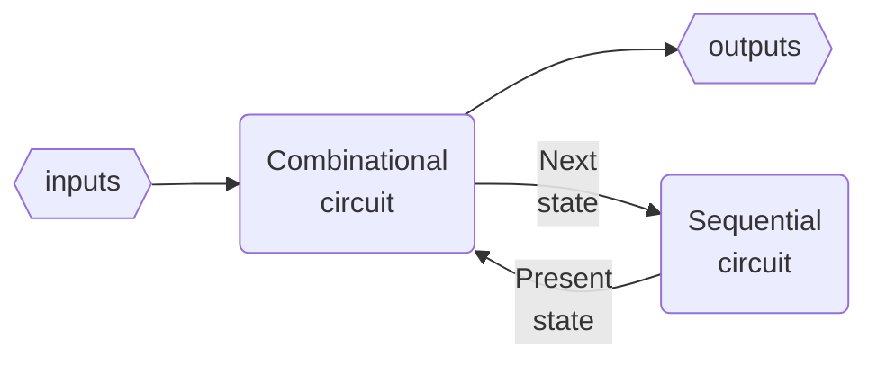
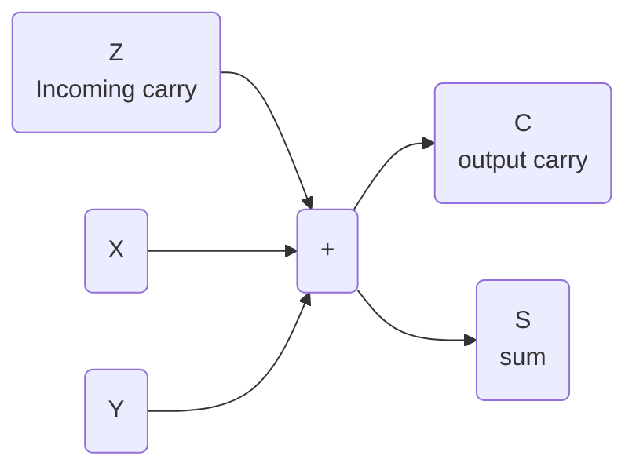

# Combinational logic design
_lcdf5 chapter 3_

Topics
---
- Top-down design
- Technology mapping
- Combinational functional blocks
- Rudimentary logic functions
- Decoding, encoding and selecting
- Interactive combinational circuits
- Arithmetic circuits
  - Binary adders
  - Binary subtraction
  - Binary adder-subtractors
  - Other arithmetic functions

Digital system design procedure
---

- ❶ specify functions and requirements
- ❷ formulate specification in Boolean equation or truth table
- ❸ optimize formulation
- ❹ map optimization to implementation technology
  - typically one of the two universal gates: NAND or NOR
- ❺ verify that the implementation fullfil the specification

Top-down design
---
- also called hierarchical design
- a divide-and-conquer method
- break the digital system into implementable or reusable building blocks
- combine the building blocks into the final digital system

🍎 Design of a 4-bit equality Comparator
---
- specification: p1.a
  - output 1 if A[3:0]==B[3:0] else 0
- formulation: p1.b,p1.c
  - compare bit-by-bit respectively
  - aggregate the 4 outputs
  - $E = (A[3]⨁B[3])(A[2]⨁B[2])(A[1]⨁B[1])(A[0]⨁B[0])$
- optimization:
  - algebraic manipulation
  - truth table
  - $N_i=\overline{A_i}B_i+A_i\overline{B_i}$
  - $E=\overline{N_0+N_1+N_2+N_3}$
- mapping to nand gates+inverters, or nor gates+inverters p3

| gate | nand  | nor |
|:---:|:---:|:---:|
| AND | NAND->NOT | NOTS->NOR |
| OR | NOTS->NAND | NOR->NOT |
| NOT | NAND | NOR |

- NOT gate is usually called inverter
  - can be implemented by a NAND or NOR by tying their inputs together as a single input
- NOT->NOT cancels

Building blocks p2
---
- primitive blocks
- predefined blocks
- regular circuits are scalable
  - irregular circuits are non-scalable
- a copy of a reusable building block is an instance of it
  - the procedure is called instantiation

🍎 Example
---
Implementation the following functions with NAND gates+inverters, then NOR gates+inverters
- $F = AB + \overline{(AB)}C + \overline{(AB})\overline{D} + E$
  - NAND gates+inverters p4
  - NOR gates+inverters p5

Rudimentary Logic Functions
---
p6

Functions of one variable
---
p7
| $X$ | $F=0$ Fixing | $F= 1$ Fixing| $F=X$ Transferring | $F=\overline{X}$ Inverting |
|:--:|:--:|:--:|:--:|:--:|
| 0 | 0 | 1 | 0 | 1 |
| 1 | 0 | 1 | 1 | 0 |

- implementation of functions of a single variable X p8

Multiple-bit functions
---
p9
- vectors of single-bit functions
- $F[n:0] = (F_{n-1}, ⋯, F_2, F_1, F_0)$
  - $F[n-1:0]$ is a n-bit bus
- $F_i=G_i(A_{m-1},  ⋯, A_1,A_0)=G_i(A[m-1:0])$
  - $A[m-1:0]$ is a m-bit bus

💡  Design Lecture-Hall Lighting Control
---
- The house light (H) is controlled by two switches
  - $P$ - podium switch
  - $R$ - rear door switch
- in three modes
  - $M_0$: Either switch P or switch R turns the house lights on and off
  - $M_1$: Only the podium switch P turns the house lights on and off
  - $M_2$: Only the rear switch R turns the house lights on and off
- This requirement is specified in truth table p10
- formulation:
  - $H(P,R,I_0,I_1,I_2,I_3)=\overline{P}⋅\overline{R}I_0+\overline{P}RI_1+P\overline{R}I_2+PRI_3$
    - the modes are selected by $I[3:0]$
  - implementation: p11
  - $I[3:0]$ work as enabling signals p12

💡 Design Car electrical Control using enabling
---
- Inputs
  - Ignition switch IG: Value 0 if off and value 1 if on
  - Light switch LS: Value 0 if off and value 1 if on
  - Radio switch RS: Value 0 if off and value 1 if on
  - Power window switch WS: Value 0 if off and value 1 if on
- Outputs
  - Lights L: Value 0 if off and value 1 if on
  - Radio R: Value 0 if off and value 1 if on
  - Power windows W: Value 0 if off and value 1 if on
- specification: 
  - in truth table p13
- implementation: p14

Decoding
---
- An n-bit binary code is capable of representing up to $2^n$ distinct elements of coded information
- Decoding is the conversion of an n-bit input code $m_i$ to an m-bit output code with $n ≤ m ≤ 2^n$, done by a n–to–m-line decoder
  - generates no more than $2^n$ minterms from the n input variables
  - so only one output value $D_i$ is set to be 1 for each input value $m_i$
- 1-to-2 decoder: p15
   - $D[1:0]=[A,\overline{A}]$
   - $D_i=m_i$
- 2-to-4 decoder: p16
  - $D[3:0]=[A_1A_0, A_1\overline{A_0}, \overline{A_1}A_0, \overline{A_1A_0}]$
  - $D_i=m_i$
  - can be constructed in 2 1-to-2 decoder+ 4 AND gates
- 3-to-8 decoder: p17
  - can be constructed in 1 2-to-4 decoder + 1 1-to-2 decoder + 8 AND gates
- generally, for a n-to-$2^n$ decoder:
  - formulation:
    - $D_i=m_A(i)$
      - $m_A(i)$ is the $i^{th}$ minterm of $A[n-1:0]$
  - implementation in 3 steps:
  - ❶ let k=n
  - ❷ if k is even, use $2^k$ AND gates driven by two $\frac{k}{2}$-to-$2^{\frac{k}{2}}$ decoders
  - if n is odd, use $2^k$ AND gates driven by a $\frac{k + 1}{2}$-to-$2^{\frac{k + 1}{2}}$ decoder and a $\frac{k - 1}{2}$-to-$2^{\frac{k - 1}{2}}$ decoder 
  - k = k/2
  - ❸ For each decoder resulting from step ❷, repeat step ❷ with k equal to the values obtained in step ❷ until k = 1. For k = 1, use a 1–to–2 decoder

💡 Demo
---
- Design a 6-to-64 decoder p18
- first run of step ❷:
  - k=6: $2^6=64$ AND gates driven by two 3-to-8 decoders. k=k/2=3
- second run of step ❷:
  - k=3: $2^3=8$ AND gates driven by a 2-to-4 decoder and  a 1-to-2 decoder

📝 Practice
---
- Design the following decoders
  - 4-to-16 decoder
  - 5-to-32 decoder

Enabling Decoder Outputs
---
- attach m enabling circuits to the decoder outputs p19
  - such a circuit is called a *demultiplexer*

Decoder-Based Combinational Circuits
---
- Any combinational circuit with n inputs and m outputs can be implemented with an n–to–$2^n$-line decoder and m OR gates
  - A decoder provides the $2n^$ minterms of n input variables
  - any Boolean function can be expressed as a sum of minterms
- A function having a list of $k$ minterms can be expressed in its complement form with $2^n - k$ minterms

💡 Implement a 1-bit binary adder
---

- specification in truth table p24
- formulation:
  - $S(X, Y, Z ) = Σm (1, 2, 4, 7)$
  - $C(X, Y, Z ) = Σm(3, 5, 6, 7)$
- implementation p25
  

📝 Practice
---
- Reimplement the 1-bit binary adder with complements
- formulation:
  - $\overline{S}(X, Y, Z ) = Σm (0,3,5,6)$
  - ∴ S(X, Y, Z ) = $\overline{Σm (0,3,5,6)}$
  - $\overline{C}(X, Y, Z ) = Σm(0,1,2,4)$
  - ∴ $C(X, Y, Z ) = \overline{Σm(0,1,2,4)}$
- implementation:
  - use NOR gate to combine the minterms

Encoding
---
- $2^n$-to-n line encoder inverses n-to-$2^n$ encoder
- A 8–to–3-line encoder is specified in truth table p26
- formulated in equations
  - $A_0 = D_1 + D_3 + D_5 + D_7$
  - $A_1 = D_2 + D_3 + D_6 + D_7$
  - $A_2 = D_4 + D_5 + D_6 + D_7$
- this implementation has two ambiguities
  - ❶ only one input can be active at any given time
    - ❓ If both $D_3$ and $D_6$ are active, what will happen?
    - the output will be 111, neither decimal 3 or 6
    - can be resolved by prioritizing the inputs (higher) by their subscript numbers (bigger)
  - ❷ an output of all 0s is generated when all the inputs are 0
    - the same as when $D_0$ is equal to 1
    - can be resolved by providing a separate output to indicate that at least one input is equal to 1

Resolve the two encoding ambiguities
---
Let's design a 4-to-2 priority encoder
- specification in truth table p27
- optimization with K-map p28
- implementation p29

Selection of information
---
- a single selection output is made from a set of inputs, typically by
  - multiplexer
  - three-state driver

Multiplexer
---
- $n$ selection inputs $S[n-1:0]$ select one $Y$ out of $2^n$ input lines $I[2^n-1:0]$
- also called data selector, or simply MUX
- n=1: *2-to-1 line multiplexer* with 1 selection input
  - specification in truth table p30
  - formulation: $Y=\overline{S}I_0+SI_1$
    - $Y=I_0$ when $S=0$
    - $Y=I_1$ when $S=1$
  - implementation p31
- n=2:  *4–to–1 line multiplexer* with 2 selection inputs
  - specification in condensed truth table p32
  - formulation: 
    - $Y=m_S(k)I_k=(\overline{S_1}⋅\overline{S_0})I_0+(\overline{S_1}S_0)I_1+(S_1\overline{S_0})I_2+(S_1⋅S_0)I_3$
  - implementation p33
- n=n: $2^n$-to-1 line multiplexer
  - $n$ selection inputs $S[n-1:0]$ select one $Y$ out of $2^n$ input lines $I[2^n-1:0]$
  - $S[n-1:0]$ can represent $2^n$ different values 0 to $2^n-1$
  - $Y=I_k$ if $S[n-1:0]=m_S(k)$
    - $m_S(k)$ the $k^{th}$ minterm of $S[n-1:0]$
  - $\displaystyle Y=\sum_{k=0}^{2^n-1}m_S(k)I_k$
  - implementation: n selection inputs → a n-to-$2^n$ decoder → $2^n$ AND gates with $2^n$ inputs to be selected (enabling circuits) → $2^n$ input OR gate → Y=selected input

💡 Implement a 64-to-1 line multiplexer
---
- p34

💡 Implement a 4-to-1 line quad multiplexer
---
- formulation
  - $\displaystyle Y[0:3]=\sum_{k=0}^{2^2-1}m_A(k)I[0:3,k]$
- p35
- generalized to $2^n$-to-1 $2^n$ multiplexer
  - $\displaystyle Y[0:2^n-1]=\sum_{k=0}^{2^n-1}m_A(k)I[0:2^n-1,k]$

📝 Multiplexer-Based Combinational Circuits
---
Implement a binary-adder bit, or a 1-bit binary adder in multiplexer. (Method ❶)
- idea:
  - a multiplexer consists of decoder and enabler-OR
  - the decoder in generates the min
terms of the selection inputs
  - the enabler-OR selects $I_k$ if $S[n-1:0]=m_S(k)$, alternatively speaking,
    - $I_k=1$, $m_S(k)$ is attached to the OR gate
    - $I_k=0$, $m_S(k)$ is not selected, the $k^{th}$ enabler presents 0 to the OR gate
- specification in truth table p24
  - 3 inputs X,Y,Z means 8 minterms, and 2 outputs C,S
  - a good choice: a dual 8–to–1 line multiplexer
  - review __💡 Implement a 1-bit binary adder__ above
    - $S(X, Y, Z ) = Σm (1, 2, 4, 7)$
    - $C(X, Y, Z ) = Σm(3, 5, 6, 7)$
- implementation p44
  - $[I_{k,0},I_{k,1}]$ = the values  of [C,S] on the $k^{th}$ row of table p24
- ---
Method  ❷
- idea: the enabler is an AND gate
  - use one of the three variables such as $Z$ as the enabling input
  - then $X,Y$ can be used as the selection inputs
- $S(X, Y, Z ) = Σm (1, 2, 4, 7)$
  - $=Σm(001,010,100,111)$
  - $=Σm[(01,10)0, (00,11)1]$
  - $=Σm[(1,2)\overline{Z}, (0,3)Z]$
- $C(X, Y, Z ) = Σm(3, 5, 6, 7)$
  - $=Σm(011,101,110,111)$
  - $=Σm[(11)(\overline{Z}+Z), (01,10)Z]$
  - $=Σm[(3)1, (1,2)Z]$, $m_0$ is NOT used, so disable it
  - $=Σm[(0)0, (3)1, (1,2)Z]$
- implementation with a dual 4-to-1 line multiplexer p45
- this procedure can be generalized to implement any Boolean function of n variables with a $2^{n-1}$-to-(n-1) multiplexer

📝 Implement the 4-variable function with multiplexer
---
- $F(A, B, C, D) = Σm(1, 3, 4, 11, 12, 13, 14, 15)$
  - $=Σm(0001,0011,0100, 1011, 1100,1101,1110,1111)$
  - $=Σm[(0)D,(1)D,(2)\overline{D},(5)D,(6)\overline{D},(6)D,(7)\overline{D}, (7)D]$
  - $=Σ[(0,1,5)D,(2)\overline{D},(6,7)1]$, missing minterms are disabled, so
  - $=Σ[(3,4)0,(0,1,5)D,(2)\overline{D},(6,7)1]$
- use method ❷ generalization
- p46 by truth table
- by algebraic manipulation
  - $F=Σm(0001,0011,0100, 1011, 1100,1101,1110,1111)$
  - $=Σm[(0)D,(1)D,(2)\overline{D},(5)D,(6)\overline{D},(6)D,(7)\overline{D}, (7)D]$
  - $=Σ[(0,1,5)D,(2)\overline{D},(6,7)1]$, missing minterms are disabled, so
  - $=Σ[(3,4)0,(0,1,5)D,(2)\overline{D},(6,7)1]$

# References
---
- [mit 6.111 Introductory Digital Systems Laboratory](https://ocw.mit.edu/courses/6-111-introductory-digital-systems-laboratory-spring-2006/)