# Combinational logic design
_lcdf5 chapter 3_

Topics
---
- Top-down design
- Technology mapping
- Combinational functional blocks
- Rudimentary logic functions
- Decoding, encoding and selecting
- Interactive combinational circuits
- Arithmetic circuits
  - Binary adders
  - Binary subtraction
  - Binary adder-subtractors
  - Other arithmetic functions

Digital system design procedure
---

```mermaid
flowchart LR
s("❶ specification")
f("❷ formulation")
o("❸ optimization")
m("❹ mapping")
v("❺ verification")
s-->f
f-->o
o-->m-->v-->s
```

- ❶ specify functions and requirements
- ❷ formulate specification in Boolean equation or truth table
- ❸ optimize formulation
- ❹ map optimization to implementation technology
  - typically one of the two universal gates: NAND or NOR
- ❺ verify that the implementation fullfil the specification

Top-down design
---
- also called hierarchical design
- a divide-and-conquer method
- break the digital system into implementable or reusable building blocks
- combine the building blocks into the final digital system

🍎 Design of a 4-bit equality Comparator
---
- specification:
  - output 1 if A[3:0]==B[3:0] else 0
- formulation:
  - compare bit-by-bit respectively
  - aggregate the 4 outputs
  - $F = (A[3]⨁B[3])(A[2]⨁B[2])(A[1]⨁B[1])(A[0]⨁B[0])$
- optimization:
  - algebraic manipulation
  - truth table
- mapping to nand gates+inverters, or nor gates+inverters

| gate | nand  | nor |
|:---:|:---:|:---:|
| AND | NAND->NOT | NOTS->NOR |
| OR | NOTS->NAND | NOR->NOT |
| NOT | NAND | NOR |

- NOT gate is usually called inverter
  - can be implemented by a NAND or NOR by tying their inputs together as a single input
- NOT->NOT cancels

Building blocks
---
- primitive blocks
- predefined blocks
- regular circuits are scalable
  - irregular circuits are non-scalable
- a copy of a reusable building block is an instance of it
  - the procedure is called instantiation

🍎 Example
---
Implementation the following functions with NAND gates+inverters, then NOR gates+inverters
- $F = AB + \overline{(AB)}C + \overline{(AB})\overline{D} + E$
- demonstrate in [draw.io](https://app.diagrams.net/)

Rudimentary Logic Functions
---

Functions of one variable
---
| $X$ | $F=0$ Fixing | $F= 1$ Fixing| $F=X$ Transferring | $F=\overline{X}$ Inverting |
|:--:|:--:|:--:|:--:|:--:|
| 0 | 0 | 1 | 0 | 1 |
| 1 | 0 | 1 | 1 | 0 |

Multiple-bit functions
---
- vectors of single-bit functions
- $F[n:0] = (F_{n-1}, ⋯, F_2, F_1, F_0)$
  - $F[n-1:0]$ is a n-bit bus
- $F_i=G_i(A_{m-1},  ⋯, A_1,A_0)=G_i(A[m-1:0])$
  - $A[m-1:0]$ is a m-bit bus

💡  Design Lecture-Hall Lighting Control
---
- controlled by two switches
  - $P$ - podium switch
  - $R$ - rear door switch
- in three modes
  - $M_0$: Either switch P or switch R turns the house lights on and off
  - $M_1$: Only the podium switch P turns the house lights on and off
  - $M_2$: Only the rear switch R turns the house lights on and off
- hint: control modes by enabling

💡 Design Car electrical Control using enabling
---
- Inputs
  - Ignition switch IG: Value 0 if off and value 1 if on
  - Light switch LS: Value 0 if off and value 1 if on
  - Radio switch RS: Value 0 if off and value 1 if on
  - Power window switch WS: Value 0 if off and value 1 if on
- Outputs
  - Lights L: Value 0 if off and value 1 if on
  - Radio R: Value 0 if off and value 1 if on
  - Power windows W: Value 0 if off and value 1 if on
  - hint: ignition is the enabling signal for all other switches

Decoding
---
- An n-bit binary code is capable of representing up to $2^n$ distinct elements of coded information
- Decoding is the conversion of an n-bit input code $m_i$ to an m-bit output code with $n ≤ m ≤ 2^n$, done by a n–to–m-line decoder
  - generates no more than $2^n$ minterms from the n input variables
  - so only one output value $D_i$ is set to be 1 for each input value $m_i$
- 1-to-2 decoder: 
   - $D[1:0]=[A,\overline{A}]$
   - $D_i=m_i$
- 2-to-4 decoder:
  - $D[3:0]=[A_1A_0, A_1\overline{A_0}, \overline{A_1}A_0, \overline{A_1A_0}]$
  - $D_i=m_i$
  - can be constructed in 2 1-to-2 decoder+ 4 AND gates
- 3-to-8 decoder:
  - can be constructed in 1 2-to-4 decoder + 1 1-to-2 decoder + 8 AND gates
- generally, for a n-to-$2^n$ decoder:
  - ❶ let k=n
  - ❷ if k is even, use $2^k$ AND gates driven by two $\frac{k}{2}$-to-$2^{\frac{k}{2}}$ decoders
  - if n is odd, use $2^k$ AND gates driven by a $\frac{k + 1}{2}$-to-$2^{\frac{k + 1}{2}}$ decoder and a $\frac{k - 1}{2}$-to-$2^{\frac{k - 1}{2}}$ decoder 
  - k = k/2
  - ❸ For each decoder resulting from step ❷, repeat step ❷ with k equal to the values obtained in step ❷ until k = 1. For k = 1, use a 1–to–2 decoder

💡 Demo
---
- Find the Boolean functions, truth tables, implementation and schematic symbols for
  - 1-to-2 line decoder
  - 2-to-4 line decoder
  - 3-to-8 line decoder

💡 Demo
---
- Design a 6-to-64 decoder
- first run of step ❷:
  - k=6: $2^6=64$ AND gates driven by two 3-to-8 decoders. k=k/2=3
- second run of step ❷:
  - k=3: $2^3=8$ AND gates driven by a 2-to-4 decoder and  a 1-to-2 decoder

📝 Practice
---
- Design the following decoders
  - 4-to-16 decoder
  - 5-to-32 decoder

# References
---
- [mit 6.111 Introductory Digital Systems Laboratory](https://ocw.mit.edu/courses/6-111-introductory-digital-systems-laboratory-spring-2006/)