# Combinational logic design
_lcdf5 chapter 3_

Topics
---
- Top-down design
- Technology mapping
- Combinational functional blocks
- Rudimentary logic functions
- Decoding, encoding and selecting
- Interactive combinational circuits
- Arithmetic circuits
  - Binary adders
  - Binary subtraction
  - Binary adder-subtractors
  - Other arithmetic functions

Digital system design procedure
---

```mermaid
flowchart LR
s("❶ specification")
f("❷ formulation")
o("❸ optimization")
m("❹ mapping")
v("❺ verification")
s-->f
f-->o
o-->m-->v-->s
```

- ❶ specify functions and requirements
- ❷ formulate specification in Boolean equation or truth table
- ❸ optimize formulation
- ❹ map optimization to implementation technology
  - typically one of the two universal gates: NAND or NOR
- ❺ verify that the implementation fullfil the specification

Top-down design
---
- also called hierarchical design
- a divide-and-conquer method
- break the digital system into implementable or reusable building blocks
- combine the building blocks into the final digital system

🍎 Design of a 4-bit equality Comparator
---
- specification: p1.a
  - output 1 if A[3:0]==B[3:0] else 0
- formulation: p1.b,p1.c
  - compare bit-by-bit respectively
  - aggregate the 4 outputs
  - $E = (A[3]⨁B[3])(A[2]⨁B[2])(A[1]⨁B[1])(A[0]⨁B[0])$
- optimization:
  - algebraic manipulation
  - truth table
  - $N_i=\bar{A_i}B_i+A_i\bar{B_i}$
  - $E=\overline{N_0+N_1+N_2+N_3}$
- mapping to nand gates+inverters, or nor gates+inverters p3

| gate | nand  | nor |
|:---:|:---:|:---:|
| AND | NAND->NOT | NOTS->NOR |
| OR | NOTS->NAND | NOR->NOT |
| NOT | NAND | NOR |

- NOT gate is usually called inverter
  - can be implemented by a NAND or NOR by tying their inputs together as a single input
- NOT->NOT cancels

Building blocks p2
---
- primitive blocks
- predefined blocks
- regular circuits are scalable
  - irregular circuits are non-scalable
- a copy of a reusable building block is an instance of it
  - the procedure is called instantiation

🍎 Example
---
Implementation the following functions with NAND gates+inverters, then NOR gates+inverters
- $F = AB + \overline{(AB)}C + \overline{(AB})\bar{D} + E$
  - NAND gates+inverters p4
  - NOR gates+inverters p5

Rudimentary Logic Functions
---
p6

Functions of one variable
---
p7
| $X$ | $F=0$ Fixing | $F= 1$ Fixing| $F=X$ Transferring | $F=\bar{X}$ Inverting |
|:--:|:--:|:--:|:--:|:--:|
| 0 | 0 | 1 | 0 | 1 |
| 1 | 0 | 1 | 1 | 0 |

- implementation of functions of a single variable X p8

Multiple-bit functions
---
p9
- vectors of single-bit functions
- $F[n:0] = (F_{n-1}, ⋯, F_2, F_1, F_0)$
  - $F[n-1:0]$ is a n-bit bus
- $F_i=G_i(A_{m-1},  ⋯, A_1,A_0)=G_i(A[m-1:0])$
  - $A[m-1:0]$ is a m-bit bus

💡  Design Lecture-Hall Lighting Control
---
- The house light (H) is controlled by two switches
  - $P$ - podium switch
  - $R$ - rear door switch
- in three modes
  - $M_0$: Either switch P or switch R turns the house lights on and off
  - $M_1$: Only the podium switch P turns the house lights on and off
  - $M_2$: Only the rear switch R turns the house lights on and off
- This requirement is specified in truth table p10
- formulation:
  - $H(P,R,I_0,I_1,I_2,I_3)=\bar{P}\bar{R}I_0+\bar{P}RI_1+P\bar{R}I_2+PRI_3$
    - the modes are selected by $I[3:0]$
  - implementation: p11
  - $I[3:0]$ work as enabling signals p12

💡 Design Car electrical Control using enabling
---
- Inputs
  - Ignition switch IG: Value 0 if off and value 1 if on
  - Light switch LS: Value 0 if off and value 1 if on
  - Radio switch RS: Value 0 if off and value 1 if on
  - Power window switch WS: Value 0 if off and value 1 if on
- Outputs
  - Lights L: Value 0 if off and value 1 if on
  - Radio R: Value 0 if off and value 1 if on
  - Power windows W: Value 0 if off and value 1 if on
- specification: 
  - in truth table p13
- implementation: p14

Decoding
---
- An n-bit binary code is capable of representing up to $2^n$ distinct elements of coded information
- Decoding is the conversion of an n-bit input code $m_i$ to an m-bit output code with $n ≤ m ≤ 2^n$, done by a n–to–m-line decoder
  - generates no more than $2^n$ minterms from the n input variables
  - so only one output value $D_i$ is set to be 1 for each input value $m_i$
- 1-to-2 decoder: p15
   - $D[1:0]=[A,\bar{A}]$
   - $D_i=m_i$
- 2-to-4 decoder: p16
  - $D[3:0]=[A_1A_0, A_1\bar{A_0}, \bar{A_1}A_0, \bar{A_1A_0}]$
  - $D_i=m_i$
  - can be constructed in 2 1-to-2 decoder+ 4 AND gates
- 3-to-8 decoder: p17
  - can be constructed in 1 2-to-4 decoder + 1 1-to-2 decoder + 8 AND gates
- generally, for a n-to-$2^n$ decoder:
  - formulation:
    - $D_i=m_A(i)$
      - $m_A(i)$ is the $i^{th}$ minterm of $A[n-1:0]$
  - implementation in 3 steps:
  - ❶ let k=n
  - ❷ if k is even, use $2^k$ AND gates driven by two $\frac{k}{2}$-to-$2^{\frac{k}{2}}$ decoders
  - if k is odd, use $2^k$ AND gates driven by a $\frac{k + 1}{2}$-to-$2^{\frac{k + 1}{2}}$ decoder and a $\frac{k - 1}{2}$-to-$2^{\frac{k - 1}{2}}$ decoder 
  - k = k/2
  - ❸ For each decoder resulting from step ❷, repeat step ❷ with k equal to the values obtained in step ❷ until k = 1. For k = 1, use a 1–to–2 decoder

💡 Demo
---
- Design a 6-to-64 decoder p18
- first run of step ❷:
  - k=6: $2^6=64$ AND gates driven by two 3-to-8 decoders. k=k/2=3
- second run of step ❷:
  - k=3: $2^3=8$ AND gates driven by a 2-to-4 decoder and  a 1-to-2 decoder

📝 Practice
---
- Design the following decoders
  - 4-to-16 decoder
  - 5-to-32 decoder

Enabling Decoder Outputs
---
- attach m enabling circuits to the decoder outputs p19
  - such a circuit is called a *demultiplexer*

Decoder-Based Combinational Circuits
---
- Any combinational circuit with n inputs and m outputs can be implemented with an n–to–$2^n$-line decoder and m OR gates
  - A decoder provides the $2^n$ minterms of n input variables
  - any Boolean function can be expressed as a sum of minterms
- A function having a list of $k$ minterms can be expressed in its complement form with $2^n - k$ minterms

💡 Implement a 1-bit binary adder
---

- specification in truth table p24
- formulation:
  - $S(X, Y, Z ) = Σm (1, 2, 4, 7)$
  - $C(X, Y, Z ) = Σm(3, 5, 6, 7)$
- implementation p25
  

📝 Practice
---
- Reimplement the 1-bit binary adder with complements
- formulation:
  - $\bar{S}(X, Y, Z ) = Σm (0,3,5,6)$
  - ∴ S(X, Y, Z ) = $\overline{Σm (0,3,5,6)}$
  - $\bar{C}(X, Y, Z ) = Σm(0,1,2,4)$
  - ∴ $C(X, Y, Z ) = \overline{Σm(0,1,2,4)}$
- implementation:
  - use NOR gate to combine the minterms

Encoding
---
- $2^n$-to-n line encoder inverses n-to-$2^n$ encoder
- A 8–to–3-line encoder is specified in truth table p26
- formulated in equations
  - $A_0 = D_1 + D_3 + D_5 + D_7$
  - $A_1 = D_2 + D_3 + D_6 + D_7$
  - $A_2 = D_4 + D_5 + D_6 + D_7$
- this implementation has two ambiguities
  - ❶ only one input can be active at any given time
    - ❓ If both $D_3$ and $D_6$ are active, what will happen?
    - the output will be 111, neither decimal 3 or 6
    - can be resolved by prioritizing the inputs (higher) by their subscript numbers (bigger)
  - ❷ an output of all 0s is generated when all the inputs are 0
    - the same as when $D_0$ is equal to 1
    - can be resolved by providing a separate output to indicate that at least one input is equal to 1

Resolve the two encoding ambiguities
---
Let's design a 4-to-2 priority encoder
- specification in truth table p27
- optimization with K-map p28
  - $A_0=D_3+D_1\bar{D_2}$
  - $A_1=D_2+D_3$
  - $V=D_0+D_1+D_2+D_3$
- implementation p29

Selection of information
---
- a single selection output is made from a set of inputs, typically by
  - multiplexer
  - three-state driver

Multiplexer
---
- $n$ selection inputs $S[n-1:0]$ select one $Y$ out of $2^n$ input lines $I[2^n-1:0]$
- also called data selector, or simply MUX
- n=1: *2-to-1 line multiplexer* with 1 selection input
  - specification in truth table p30
  - formulation: $Y=\bar{S}I_0+SI_1$
    - $Y=I_0$ when $S=0$
    - $Y=I_1$ when $S=1$
  - implementation p31
- n=2:  *4–to–1 line multiplexer* with 2 selection inputs
  - specification in condensed truth table p32
  - formulation: 
    - $\displaystyle Y=\sum_{k=0}^3 m_S(k)I_k=(\bar{S_1}\bar{S_0})I_0+(\bar{S_1}S_0)I_1+(S_1\bar{S_0})I_2+(S_1⋅S_0)I_3$
  - implementation p33
- n=n: $2^n$-to-1 line multiplexer
  - $n$ selection inputs $S[n-1:0]$ select one $Y$ out of $2^n$ input lines $I[2^n-1:0]$
  - $S[n-1:0]$ can represent $2^n$ different values 0 to $2^n-1$
  - $Y=I_k$ if $S[n-1:0]=m_S(k)$
    - $m_S(k)$ the $k^{th}$ minterm of $S[n-1:0]$
  - $\displaystyle Y=\sum_{k=0}^{2^n-1}m_S(k)I_k$
  - implementation: n selection inputs → a n-to- $2^n$ decoder → $2^n$ AND gates with $2^n$ inputs to be selected (enabling circuits) → $2^n$ input OR gate → Y=selected input

💡 Implement a 64-to-1 line multiplexer
---
- p34

💡 Implement a 4-to-1 line quad multiplexer
---
- formulation
  - $\displaystyle Y[0:3]=\sum_{k=0}^{2^2-1}m_A(k)I[0:3,k]$
- p35
- generalized to $2^n$-to-1 $2^n$ multiplexer
  - $\displaystyle Y[0:2^n-1]=\sum_{k=0}^{2^n-1}m_A(k)I[0:2^n-1,k]$

📝 Multiplexer-Based Combinational Circuits
---
Implement a binary-adder bit, or a 1-bit binary adder in multiplexer. (Method ❶)
- idea:
  - a multiplexer consists of decoder and enabler-OR
  - the decoder in generates the min
terms of the selection inputs
  - the enabler-OR selects $I_k$ if $S[n-1:0]=m_S(k)$, alternatively speaking,
    - $I_k=1$, $m_S(k)$ is attached to the OR gate
    - $I_k=0$, $m_S(k)$ is not selected, the $k^{th}$ enabler presents 0 to the OR gate
- specification in truth table p24
  - 3 inputs X,Y,Z means 8 minterms, and 2 outputs C,S
  - a good choice: a dual 8–to–1 line multiplexer
  - review __💡 Implement a 1-bit binary adder__ above
    - $S(X, Y, Z ) = Σm (1, 2, 4, 7)$
    - $C(X, Y, Z ) = Σm(3, 5, 6, 7)$
- implementation p44
  - $[I_{k,0},I_{k,1}]$ = the values  of [C,S] on the $k^{th}$ row of table p24
- ---
Method  ❷
- idea: the enabler is an AND gate
  - use one of the three variables such as $Z$ as the enabling input
  - then $X,Y$ can be used as the selection inputs
- $S(X, Y, Z ) = Σm (1, 2, 4, 7)$
  - $=Σm(001,010,100,111)$
  - $=Σm[(01,10)0, (00,11)1]$
  - $=Σm[(1,2)\bar{Z}, (0,3)Z]$
- $C(X, Y, Z ) = Σm(3, 5, 6, 7)$
  - $=Σm(011,101,110,111)$
  - $=Σm[(11)(\bar{Z}+Z), (01,10)Z]$
  - $=Σm[(3)1, (1,2)Z]$, $m_0$ is NOT used, so disable it
  - $=Σm[(0)0, (3)1, (1,2)Z]$
- implementation with a dual 4-to-1 line multiplexer p45
- this procedure can be generalized to implement any Boolean function of n variables with a $2^{n-1}$-to-(n-1) multiplexer

📝 Implement the 4-variable function with multiplexer
---
- $F(A, B, C, D) = Σm(1, 3, 4, 11, 12, 13, 14, 15)$
- use method ❷ generalization
- p46 by truth table
- by algebraic manipulation
  - $F=Σm(0001,0011,0100, 1011, 1100,1101,1110,1111)$
  - $=Σm[(0)D,(1)D,(2)\bar{D},(5)D,(6)\bar{D},(6)D,(7)\bar{D}, (7)D]$
  - $=Σ[(0,1,5)D,(2)\bar{D},(6,7)1]$, missing minterms are disabled, so
  - $=Σ[(3,4)0,(0,1,5)D,(2)\bar{D},(6,7)1]$

💡 Demo
---
Design a bCD–to–[Seven-Segment](https://en.wikipedia.org/wiki/Seven-segment_display) Decoder with logic gates, decoders, or multiplexers
- specification: 
  - function description p47
  - truth table p48
- optimization
  - $a = \bar{A}C + \bar{A}BD + \bar{B} \bar{C} \bar{D} + A\bar{B} \bar{C}$
  - $b = \bar{A}\bar{B} + \bar{A} \bar{C} \bar{D} + \bar{A}CD + A\bar{B} \bar{C}$
  - $c = \bar{A}B + \bar{A}D + \bar{B} \bar{C} \bar{D} + A\bar{B} \bar{C}$
  - $d = \bar{A}C\bar{D} + \bar{A} \bar{B}C + \bar{B} \bar{C} \bar{D} + A\bar{B} \bar{C} + \bar{A}B\bar{C}D$
  - $e = \bar{A}C\bar{D} + \bar{B} \bar{C} \bar{D}$
  - $f = \bar{A}B\bar{C} + \bar{A} \bar{C} \bar{D} + \bar{A}B\bar{D} + A\bar{B} \bar{C}$
  - $g = \bar{A}C\bar{D} + \bar{A} \bar{B}C + \bar{A}B\bar{C} + A\bar{B} \bar{C}$
- implement in gates
- implement in decoder or multiplexer
  - $a(A, B, C, D) = Σm(0, 2, 3, 5, 6, 7, 8, 9)$
  - $b(A, B, C, D) = Σm(0, 1, 2, 3, 4, 7, 8, 9)$
  - $c(A, B, C, D) = Σm(0, 1, 3, 4, 5, 6, 7, 8, 9)$
  - $d(A, B, C, D) = Σm(0 ,2, 3, 5, 6, 8, 9)$
  - $e(A, B, C, D) = Σm(0, 2, 6, 8)$
  - $f(A, B, C, D) = Σm(0, 4, 5, 6, 8, 9)$
  - $g(A, B, C, D) = Σm(2, 3, 4, 5, 6, 8, 9)$
- decoder implementation:
  - seven 4-to-16 line decoder + 7 OR gates with multiple inputs
- multiplexer implementation: p49
  - seven 8-to-1 multiplexers, or
  - a 7-bit wide 8-to-1 multiplexer
  - $[A,B,C]=S[2:0]$ and $\lbrace D,\bar{D}, 1, 0\rbrace$ to the data inputs

Iterative Combinational Circuits
---
p50
- Arithmetic functional blocks are typically designed to operate on *binary input vectors* and produce *binary output vectors*
- the same subfunction, called cell,  is applied to each bit position
- the overall implementation is an *array of cells*, also called *iterative array*

Binary adders
---
- *half adder* adds 2 bits
- *full adder* adds 3 bits
  - can be constructed from 2 half adders

Half adder
---
- function description

- specification in truth table p51
- formulation
  - $S=\bar{X}Y+X\bar{Y}=X⨁Y$
  - $C=XY$
- implementation p52

Full adder
---

- specification in truth table p53
- formulation and optimization p54
  - $S = \bar{X}\bar{Y}Z + \bar{X}Y\bar{Z} + X\bar{Y} Z + XYZ$
    - $=X⨁Y⨁Z$
  - $C = XY + XZ + YZ$
    - $=XY+Z(X\bar{Y}+\bar{X}Y)$
    - $=XY+Z(X⨁Y)$
- implementation p55

Binary ripple carry adder
---
- A 4-bit ripple carry adder p56
- An n-bit ripple carry adder requires n full adders, with each output carry connected to the input carry of the next-higher-order full adder

💡 Demo
---
- Calculate $1011+1101$ on the above 4-bit ripple carry adder

Binary subtraction
---
The subtraction of two n-digit numbers, M - N , in base 2 can be done in three steps:
- ❶ do M-N
- ❷ If no end borrow occurs, then M ≥ N , 
  - the result is nonnegative and correct
- ❸ If an end borrow occurs, then M < N, 
  - in the difference, $M - N + 2^n$, $2^n$ is used to discard or cancel the end borrow
  - subtract the difference from $2^n$, and append a *minus sign* to the result
  - we get the final result, which is negative and correct
- Subtraction of a binary number from $2^n$ to obtain an n-digit result is called taking the 2s complement of the number

💡Demo
---
Unsigned binary subtraction by 2s complement subtract:
- $1001 - 0110$
  - $=0011$, no end borrow occurs
  - ∴ the result is nonnegative and correct
- $0110 - 1011$
  - $=1011+(-10000)$, end borrow `(-10000)` occurs, discard the end borrow by adding $2^4=10000$
  - the final result $=-(2^4-1011)=-(10000-1011)=-0101$
- Run both calculations on the 4-bit adder–subtractor p57

Complements
---
There are two types of complements for each base-r system: 
- the radix complement
  - the r’s complement, e.x.
  - 2's complement in binary system
- the diminished radix complement
  - the (r - 1) ’s complement, e.x.
  - 1's complement in binary system

Complements in binary system
---
Given an n-bit N, 
- its 1s complement is defined as
  - $(2^n - 1) - N$ = complementing each bit of N
    - ∵ $(2^n - 1)$ is n 1's, so $(2^n - 1) ≥ N$
    - 1-1=0, 1-0=1
- its 2s complement is defined as
  - $2^n  - N$ = complementing each bit of N then plus 1 if $N≠0$
    - ∵ $2^n  - N=[(2^n-1) - N]+1$
  - 0 if N=0
  - another method of finding 2s complement
    - from right to left, find the first 1
      - keep this first 1 and its right 0 unchanged
      - flip all bits after this 1
- the complement of the complement of N = N
  - $2^n - (2^n  - N)=N$

💡 Demo
---
- Find the 1s and 2s complement of
  - 1011001
    - 1s: 0100110
    - 2s: 0100111
  - 0001111
    - 1s: 1110000
    - 2s: 1110001

Subtraction using 2s complement
---
The subtraction of two n-digit numbers, M - N , in base 2 can be done in three steps:
- ❶ Add the 2s complement of the subtrahend N to the minuend M. This performs $M + (2^n - N) = M - N + 2^n$
- ❷ the sum produces an end carry $2^n$ if M≥N. Discard the end carry, leaving result M - N. 
- ❸ If M < N , the sum does not produce an end carry.
  - ∵ it is equal to $2^n - (N - M)$, the 2s complement of N - M
  - take the 2s complement of the sum and place a minus sign in front to obtain the result - (N - M)
-  The subtraction operation can be implemented with only a complementer and an adder using the 2s complement p58
   -  S=0, the circuit is an adder
      -  performs A+B
   -  S=1, it becomes a substractor
      -  performs A + 2s complement of B

💡 Demo
---
Given X = 1010 and Y = 1000, perform unsigned binary subtraction by 2s complement addition
- X-Y
  - the 2s complement of Y is 1000, add it to X, get 1010+1000=10010
  - discard end carry $2^4=10000$, get 0010
  - ans: 0010
- Y-X
  - the 2s complement of X is 0110, add it to Y, get 1000+0110=1110
  - no carry occurs, take 2s complement of 1110 get 0001+1=0010
  - append a minus sign to it get -0010
  - ans: -0010
- Run these calculations on the Adder-Subtractor Circuit p58

Signed binary numbers
---
- two representations 
  - *signed-magnitude*
  - *signed-complement*
- both use the most significant bit as the sign
  - 0 for positive numbers and 
  - 1 for negative numbers
- *signed-magnitude* negates a number by changing its sign
  - in addition and subtraction, the sign bit and those magnitude bits are processed `separately`
  - correction step is needed in subtraction
  - range of n-bits: $2^n$ different numbers
    - positive numbers: $1,2,⋯, (2^{n-1}-1)$
    - zero: a positive 0 and a negative 0
    - negative numbers: $-1, -2, ⋯, -(2^{n-1}-1)$
- *signed-complement* represents a negative number by its complement, all bits are processed `together`
  - it negates a number by taking its complement
  - either the 1s or the 2s complement can be used
    - `2s complement` is the most common
- range of n-bits: $2^n$ different numbers
  - positive numbers: $1,2,⋯, (2^{n-1}-1)$
  - zero: a positive 0
  - negative numbers: $-1, -2, ⋯, -2^{n-1}$

💡 Demo
---
represents -8 to +7 in both representation systems 
- in 4 bits: p59
- in 8 bits:
  - signed-magnitude: (1 bit sign)|(7 bits magnitude)
    - -8 = (1)|(000_1000)=1000_1000
    - +7 = (0)|(000_0111)=0000_0111
  - 2s complement: 
    - -8 = negation of 8 = 2s complement of 8 = (0000_1000)''=(1111_0111+1)=1111_1000
      - 8 = negation of (-8) = 2s complement of (-8) = (1111_1000)''=(0000_0111+1)=0000_1000
    - 7, positive number, no change = 0000_0111
      - -7 = negation of 7 = 2s complement of 7 = (0000_0111)''=(1111_1000+1)=1111_1001
      - 7 = negation of (-7) = 2s complement of (-7) = (1111_1001)''=(0000_0110+1)=0000_0111

Signed Binary Addition and Subtraction
---
Perform M+N in
- the signed-magnitude system
  - same signs
    - add the two magnitudes
    - give the sum the same sign
  - different signs
    - subtract the magnitude of N from the magnitude of M
    - the sign of the result is determined by whether there is an end borrow
    - a 2s complement correction maybe needed based on the sign of M
  - requires addition, and comparison or subtraction
- signed 2s complement system
  - add both numbers including their sign bits
  - A carry out of the sign bit position is discarded
  - requires only addition

💡 Demo
---
- Calculate in the signed 2s complement system for the 4-bit numbers A=3, B=5
  - $(±A)-(+B)=(±A)+(-B)$
  - $(±A)-(-B)=(±A)+(+B)$
- ans:
  - A=3=0011, -A=(0011)''=(1100+1)=1101
  - B=5=0101, -B=(0101)''=(1010+1)=1011
  - (+A)+(-B)=(+3)+(-5)=0011+1011=1110=-(1110)''=-(0001+1)=-0010=-2
  - (-A)+(-B)=(-3)+(-5)=1101+1011=(1)1000 (discard the carry) = 1000 = -(1000)''=-(0111+1)=-1000=-8
  - (+A)+(+B)=(+3)+(+5)=0011+0101=1000
    - Is this right? check p59
    - 1000 the highest bit is 1, i.e. it's a negative number equals
    - -(1000)'' = -[(1000)'+1] = -[0111+1]=-1000=-8
  - (-A)+(+B)=(-3)+(+5)=1101+0101=(1)0010 (discard the carry) = 0010 = 2
- Run the calculation on the Adder-Subtractor Circuit p58

Overflow
---
- An overflow occurs when the sum of two n-bit numbers occupies n+1 bits
  - can be detected and signaled on computer p60
  - processed automatically by exception handler
- An overflow may occur in
  - unsigned addition
  - addition of two signed numbers with same signs
  - subtraction of two signed numbers with different signs
- there is no overflow in 
  - unsigned subtraction
  - addition of two signed numbers with different signs

💡 Demo of overflow
---
Calculate in the signed 2s complement system for 4-bit numbers
- 7+6
  - = 0111+0110=1101=-(1101)''=-(0010+1)=-(0011)=-3
- 7-(-6) = 7+6
- -7-6=(-7)+(-6)
  - = (0111)''+(0110)''=(1000+1)+(1001+1)=1001+1010=(1)0011 (discard the carry) = 0011 = 3

Other Arithmetic Functions
---
- such as 
  - incrementing, decrementing, 
  - multiplication and division by a constant, 
  - greater-than comparison, and less-than comparison
- multiple-bit operands can be implemented by
  - using an iterative array of 1-bit cells, or
  - re-tasking a circuit such as a binary adder or a binary multiplier
    - this method is called *contraction*
    - contraction can be applied to equations and circuit diagrams

💡 Demo
---
Re-task a full-adder into a decrementer: $S=A-c$
- $c$ is a constant, typically 1
- Full adder equation for the i-th bit:
  - $S_i = A_i ⨁ B_i ⨁ C_i$
  - $C_{i + 1} = A_iB_i + A_iC_i + B_iC_i$
- Set $B_i=1$, 
  - $S_i = A_i ⨁ 1 ⨁ C_i=A_i ⨁ C_i$
  - $C_{i + 1} = A_i⋅1 + A_iC_i + 1⋅C_i=A_i+C_i$
- Suppose this retasking is used  in place of each of the four full adders in a 4-bit ripple carry adder
  - $S = A + B + C_0$ becomes
  - $S = A + 1111 + C_0$, in 2s complement,
  - $⇒ S = A - 1 + C_0$, let $C_0=0$, we get the decrementer
  - $S = A - 1$

Contraction based on unused outputs
---
- X, unknown value, marks an output as unused
  - those gates drive only unused output can be removed
- Rules for contracting *equations*  with unused outputs
  1. Delete all equations with Xs on the circuit outputs
  2. Delete any input and intermediate variable that does not appear in any remaining equations
  3. Repeat 1 and 2 until no new deletions are possible
- Rules for contracting a logic diagram with unused outputs
  1. Delete all gates with Xs on their outputs and place Xs on their input wires
  2. Delete any external inputs and intermediate gates that only drive Xs
  3. Repeat 1 and 2 until no new deletions are possible

💡 Demo
---
- Contract an adder into an incrementer
  - $S=A+c$
    - $c$ is a constant, typically 1
  - let $B=1$ in $A+B$, we get
    - $A+1$
- Show the contract process with a 3-bit adder p67
  - $S[2:0]=A[2:0]+001$
  - generalize the contraction to n≥3 bits

📝 Practice
---
- Contract the adder-subtractor p58 circuit into 
- an incrementer $S=0$ 
- a decrementer $S=1$
- set $B=0001$ by default

# References
---
- [mit 6.111 Introductory Digital Systems Laboratory](https://ocw.mit.edu/courses/6-111-introductory-digital-systems-laboratory-spring-2006/)