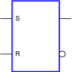
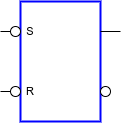
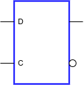
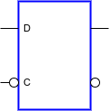
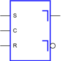
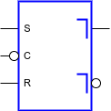
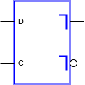
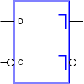
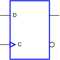
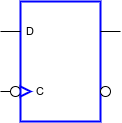

# Sequential Circuits
_lcdf5 chapter 4_


Topics
---
- circuits capable of storing information
  - synchronous sequential circuit synchronized with clock
    - flip-flops
  - asynchronous sequential circuits states changes are
    - triggered by the changes in inputs
    - latches
- describes sequential circuits in
  - State transition tables
  - state transition diagrams


# Sequential Circuit Definitions

p1
- the output Y and next state S' of a sequential circuit depends on its current state S and input X:
  - $Y+S' = f(S, X)$


Logic Structures for Storing Information
---
p2 describes several primitive storage circuits
- $t_G$ is the gate delay in several to hundreds of nanoseconds
- a) input appears at the output after $t_G$
- 0 is stored forever in b), 1 in c), and X in d)

However, there is no way to override the storage without additional inputs. 
- Asynchronous storage circuits called latches are made from these storage circuits by replacing the inverters with NOR or NAND gates
- Synchronous circuits are built from latches together with a clock generator p3
  - their outputs can change their value only in the presence of clock pulses
  - those use clock pulses as inputs for storage elements are called `clocked sequential circuits`
  - the simplest form of clocked sequential circuits are called `flip-flops`
    - they store only one bit of information
    - and change state only in response to a clock pulse

# Latches

SR latch
---
- p4 The SR latch is a circuit constructed from two cross-coupled NOR gates. 
- It has 
  - two inputs `set` S and `reset` R
  - two outputs $Q$ and $\bar{Q}$ are `normally` the complements of each other
- It is in one of the sates below at a time
  - `set state` when $(Q,\bar{Q})=(1,0)$
  - `reset state` when $(Q,\bar{Q})=(0,1)$
  - `undefined state` when $(Q,\bar{Q})=(0,0)$ and (S,R)=(1,1)
    - since it violates the requirement that the outputs be the complements of each other
    - It also results in an indeterminate or unpredictable next state when both inputs return to 0 simultaneously
- (S,R)=(0,0) is the `normal condition`
  - during normal operation, only one of S and R can be changed to 1 from 0
  - (S,R)=(1,0) transits the SR latch to `set state`
  - (S,R)=(0,1) transits the SR latch to `reset state`
- The behavior of the SR latch is illustrated in p5
  - sequence matters in sequential sequential circuits
  - a signal state is unknown when its level is 1/2 in p5
    - at the beginning, (S,R) and $Q, \bar{Q}$ are all unknown
    - (S, R)=(0, 1) → (Q,Q')=(0,1)
    - (S, R)=(0, 0) → (Q,Q')=(0,1)
    - (S, R)=(1, 0) → (Q,Q')=(1,0)
    - (S, R)=(0, 0) → (Q,Q')=(1,0)
    - (S, R)=(0, 1) → (Q,Q')=(0,1)
    - (S, R)=(0, 0) → (Q,Q')=(0,1)
    - (S, R)=(1, 1) → (Q,Q')=(1,1)
    - (S, R)=(0, 0) → (Q,Q')=(x,x)
  - In general, the latch state changes only in response to input changes and remains unchanged otherwise


$\bar{S}\bar{R}$ latch
---
- p6 The $\bar{S}\bar{R}$ latch with two cross-coupled NAND gates
  - has `set state` and `reset state` identical to SR latch
  - but has inputs and `undefined state` contrary to SR latch


SR Latch with Control Input
---
The operation of the basic NOR and NAND latches can be modiied by providing an additional control input that determines when the state of the latch can be changed.
- An SR latch with a control input is shown in p7


D Latch p8
---
- eliminates the `undefined state` in the SR latch 
  - by ensuring that S and R are never 1 at the same time
- receives its designation from its ability to hold data
  - When C=1, D → Q
  - When C=0, Q outputs old D
- it has an unreliable operation can be solved with `master–slave` flip-flop in p9
  - the left is the master and the right is the slave

# Flip-flops
- flip-flop state changes have two trigger schemes
  - `pulse-triggered` or `level-triggered` has two types
    - `positive-pulse triggered` or `high-level triggered` 
    - `negative-pulse triggered` or `low-level triggered`
  - `edge-triggered`, prevalent in contemporary design, also has two types
    - `negative-edge triggered` or `falling-edge triggered` p9
    - `positive-edge triggered` or `rising-edge triggered` p10
- The standard graphics symbols for the different types of latches and lip-lops are shown in p11


💡 Demo
---
```vhdl
-- positive-edge-triggered D flip-flop with reset;
if (RESET = '1) then
  Q <= '0';
elsif (CLK'event and CLK='1') then
  Q <= D;
end if;
```

```verilog
always @(posedge CLK or posedge RESET)
begin
  if (RESET)
    Q <= 0;
  else
    Q <= D;
end
```


Direct Inputs
---
- Flip-flops can set and reset their storages asynchronously by
  - direct set or preset to 1
  - direct reset or clear to 0
- D Flip-Flop with Direct Set and Reset p12


Summary of latches and flip-flops
---
- Without triggers

| name | symbol | set | reset | hold | undefined |
|:--:|:--:|:--:|:--:|:--:|:--:|
| SR latch | | SR=10<br>Q=1 | SR=01<br>Q=0 | SR=00<br>Q | SR=11<br>QQ'=00 |
| S'R' latch | | S'R'=01<br>Q=1 | S'R'=10<br>Q=0 | S'R'=11<br>Q | S'R'=00<br>QQ'=11 |
| D latch with 1 ctrl | | CD=11<br>Q=1 | CD=10<br>Q=0 | CD=0x <br>Q | - |
| D latch with 0 ctrl | | CD=01<br>Q=1 | CD=00<br>Q=0 | CD=1x <br>Q | - |

- With triggers

| name | symbol | set | reset | hold | undefined |
|:--:|:--:|:--:|:--:|:--:|:--:|
| HL-triggered SR latch | | CSR=110<br>Q=1 | CSR=101<br>Q=0 | CSR=x00 or 0xx<br>Q | CSR=111<br>Q=x |
| LL-triggered SR latch | | CSR=010<br>Q=1 | CSR=001<br>Q=0 | CSR=x00 or 1xx<br>Q | CSR=011<br>Q=x |
| HL-triggered D latch | | CD=11<br>Q=1 | CD=10<br>Q=0 | CD=0x <br>Q | - |
| LL-triggered D latch | | CD=01<br>Q=1 | CD=00<br>Q=0 | CD=1x <br>Q | - |
| RE-triggered D latch | | CD= ↑1<br>Q=1 | CD=↑0<br>Q=0 | CD=⤒x <br>Q | - |
| FE-triggered D latch | | CD=↓1<br>Q=1 | CD=↓0<br>Q=0 | CD=⤒x <br>Q | - |


# Sequential Circuit Analysis

Three ways to describe sequential circuits
---
- Equations: y,S'=f(x,S)
- logic diagrams
- State tables and state diagrams


Synchronous sequential circuits
---
- include flip-flops with the clock inputs driven directly or indirectly by a clock signal
- the direct sets and resets are unused during the normal functioning of the circuit


Input Equations
---
- The logic diagram of a sequential circuit consists of 
  - flip-flops and optional
  - combinational gates 
    - driving the inputs of the flip-flops 
      - can be described by a set of Boolean functions called `flip-flop input equations`
      - the `dependent variable` is denoted by the flip-flop input symbol with the name of the flip-flop output, such as $D_A$
    - and consuming the outputs of the flip-flops


🍎 Example
---
List the Boolean equations of p13
- input equations
  - $D_A=AX+BX$
  - $D_B=\overline{A}X$
- output equation
  - $Y=(A+B)\overline{X}$


State table
---
One dimensional state table p14 created with `state transition equations`
- $A(t+1)=D_A=AX+BX$
- $B(t+1)=D_B=\overline{A}X$
- `t+1` indicates the next state
- `t` indicates the current state, such as $D_{A(t)}, A(t)$, simply written as $D_A, A$

Two dimensional state table p15

- Two sequential circuit models
- Mealy model
  - the outputs depend on the inputs, and the states
- Moore model 
  - the outputs depend on only the states


🍎 Example
---
A Moore model circuit p16
- input equation
  - $D_A=A\bigoplus X \bigoplus Y$
- output equation
  - $Z=A$


State Diagram
---
- p17.a the state diagram of state table p15
- p17.b the state diagram of state table p16


Equivalent states
---
- generate identical output sequence from each possible input sequence
  - i.e. same next state and outputs from each input symbol
- equivalent states can be merged into one, called `state reduction`
- In p17.a
  - states 01, 10, 11 are equivalent
  - they can be merged into one, then only one flip-flop is needed instead of two


Sequential Circuit Simulation
---
Two types of simulation:
- functional simulation without gate delay
- timing simulation with gate delay

p18


# Sequential Circuit Design
- the key is `finding state diagrams and state tables`
- procedure
  - Specification
  - Formulation
  - State assignment
  - Flip-Flop input equation Determination
  - Output equation Determination
  - Optimization
  - Technology mapping
  - Verification
- The minimum number $n_f$ of flip-flops is determined by the number of states $n_S$ in the circuit
   - $n_f=⌈\log_2 n_S⌉$
 - The `initial state` of the flip-flops can be initiated with a `reset` signal p19
   - also called `reset state`


🍎 Example: finding a state diagram
---
- a `sequence recognizer`
  - finds a substring `1101` in a long string
    - p31, p32
  - p20 state diagram
  - p21 state table


🍎 Example: finding a state diagram
---
- (`optional`) a BCD–to–excess-3 decoder
   - Y[3:0] = BCD + 0011
     - such as, 1000(8)=0101(5)+0011(3)
     - but outputs one bit per clock instead of simultaneously
   - and `least significant bit first`
     - such as 0101(5) applies to the input as 1010, outputs 0001
- function specification
  - p22.a least significant bit first
  - p22.b in order of common prefixes
    - p23 state diagram from p22.b


State assignment
---
- in two orders:
  - counting order
  - Gray code order
- encoding states with one-hot code


🍎 Example
---
- State assignments for the sequence recognizer
  - p24 Gray code
  - p25 one-hot code


🍎 Example
---
Gray code design for the sequence recognizer based on p24
- two flip-flops are needed to represent the four states
- input equations:
  - $A(t + 1) = D_A(A, B, X) = Σm(3, 6, 7)$
  - $B(t + 1) = D_B(A, B, X) = Σm(1, 3, 5, 7)$
- output equation
  - $Z(A, B, X) = Σm(5)$
- simplify these equations with K-map p26
  - $D_A = AB + BX$
  - $D_B = X$
  - $Z = A\bar{B}X$
- a logic diagram p27


🍎 Example
---
One-hot code design for the sequence recognizer based on p25
- four flip-flops are needed to represent the four states
- input equations:
  - $A(t + 1) = D_A = A\bar{X} + B\bar{X} + D\bar{X} = (A + B + D)\bar{X}$
  - $B(t + 1) = D_B =  AX + DX = (A + D)X$
  - $C(t + 1) = D_C = BX + CX = (B + C)X$
  - $D(t + 1) = D_D = CX$
- output equation
  - $Z = DX$
- a logic diagram p28


```verilog
always @(posedge CLK or posedge RESET)
begin
  if (RESET)
    state <= S0;
  else
    state <= next_state;
end

always @(X or state)
begin
  case (state)
    S0: next_state = X? S1:S0;
    S1: next_state = X? S2:S0;
    S2: next_state = X? S2:S3;
    S3: next_state = X? S1:S0;
  endcase
end

always @(X or state)
begin
  case (state)
    S0: Z = 1'b0;
    S1: Z = 1'b0;
    S2: Z = 1'b0;
    S3: Z = X?1'b1:1'b0;
  endcase
end

```


Designing with Unused States
---
- A circuit with `n` flip-flops and `S` states has ($2^n-S$) unused states
  - e.x. p29
    - three unused states 000, 110, and 111 combined with input X results in six unused combinations
- unused states can be treated as don’t-care conditions
- used in K-map to obtain the optimized equations
  - $D_A = AX + BX + \bar{B}\bar{C}$
  - $D_B = \bar{A}\bar{C}\bar{X} + \bar{A}\bar{B}X$
  - $D_C = \bar{X}$