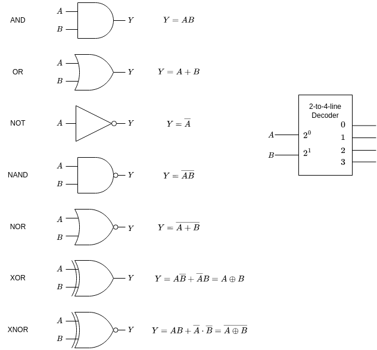
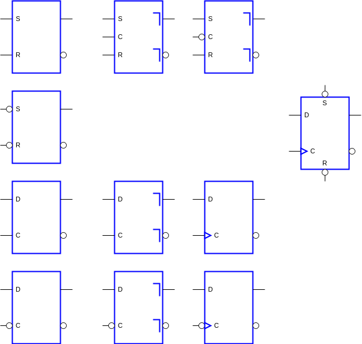

Review for final exam
---
- covers chapter 4, 6-8

Q0
---
Given the devices below,
- what is the name of each device?
- describe the behavior of each device.

Q1
---
Given the devices below,
- what is the name of each device?
- describe the behavior of each device.

Q2
---
- Describe the three ways representing sequential circuits
- How to convert a one-dimensional state table to/from a two-dimensional state table? 

Q4
---
- What is the difference between a Moore machine and a Mealy machine?

Q5
---
To create a memory of 512K×32, how many 128K×8 RAMs are needed?

Qh
---
Review homework 4-6
- homework 4:
  - Q3, Q5
- homework 5:
  - Q1, Q2, Q4
- homework 6:
  - Q5