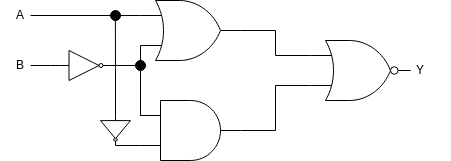

Review for midterm exam
---
- covers chapter 1 to 3

Q1
---
- Use the shortcut to convert binary numbers to octal numbers and hexadecimal numbers
- (1101101.101)₂
- to octal: 
  - (1101101.101)₂ = (001_101_101.101)₂ = (155.5)₈
- to hexadecimal:
  - (1101101.101)₂ = (0110_1101.1010)₂ = (6D.A)₁₆

Q2
---
Convert decimal number  ↔ base r number
- decimal to base r number
  - integer part: 
    - divide the quotient by r 
      - stop until the quotient becomes 0
    - collect the remainders reversely
  - fraction part:
    - multiply the fraction by r then subtract the integer part of the product 
      - stop until the fraction part becomes 0
    - collect the subtracted integers in order
- base r number to decimal
  - expand in the sum of each digit multiplying by its position power of r
  - omit each zero-digit for simplicity

 - (12.25)₁₀ to binary number
   - integer part: (1100)₂
     - 12 = 6*2 + 0
     - 6 = 3*2 + 0
     - 3 = 1*2 + 1
     - 1 = 0*2 + 1
   - fraction part: (01)₂
     - 0.25*2 = 0.5
     - 0.5*2 = 1.0
   - result: (1100.01)₂
 - (1011.101)₂ to decimal
   - = $1×2^3 + 1×2^1 + 1×2^0+1×2^{-1}+1×2^{-3}$
   - = 8+2+1+0.5+0.125
   - = (11.625)₁₀

Q3
---
- Convert decimal number ↔ BCD
  - Each decimal digit is represented with its equivalent 4 bits binary number
  - leading zeros must be kept to keep each BCD 4 bits long
- 1314 to BCD
  - $(0001001100010100)_{BCD}$
- $(001001110010.10100101)_{BCD}$
  - = $(0010|0111|0010.1001|0101)_{BCD}$
  - = 272.95

Q4
---
- Simplify Boolean expressions using algebraic manipulation.
- $\bar{A}C+\overline{ABC}$

Q5
---
- Find the Boolean function for a circuit then simplify it
- 
- $Y=\overline{(A+\bar{B})+\bar{A}\bar{B}}$
- =$\bar{A}B$

Q6
---
Given a Boolean function, 
- draw its truth table
- draw its K-map
- find its som (sum of minterm)
- and PoM (product of maxterm)
- if we order the terms in alphabetical order, then the som and PoM for any Boolean functions are unique.
  - $\bar{X}$ is considered before X in alphabetical order
  - short string is before long string

- F=AB+C
- som: F=A'B'C + A'BC + AB'C + ABC' + ABC
  - in which $X'=\bar{X}$
- PoM: F=(A'+B+C)(A+B'+C)(A+B+C)

Q7
---
- Convert decimal number ↔ 2s complement
  - positive number, no change to the binary string
  - negative number, take 2s complement of its absolute value
- Perform algebraic operations in 2s complement
  - convert subtraction to negative number
  - take 2s complement of the negative number
  - perform addition only
    - discard the end carry
    - wrong result if overflow occurs
- Perform (56)-(43) in 2s complement of 8 bits
  - Convert to addition only: (56)-(43) = (56)+(-43)
  - convert decimal number to 2s complement:
    - (56)+(-43) = (0011_1000) + (0010_1011)''
    - =(0011_1000) + [(0010_1011)'+1]
    - =(0011_1000) + [1101_0100+1]
    - =(0011_1000) + (1101_0101)
    - =(1_0000_1101) discard the end carry
    - =(0000_1101)
    - =13
